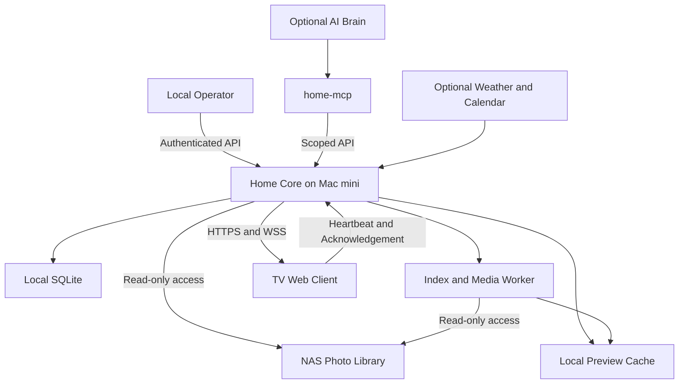

# Atrium 家庭智能中枢 PRD

| 项目 | 内容 |
| --- | --- |
| 项目名称 | Atrium |
| 文档版本 | 0.1 |
| 文档状态 | 可行性与需求草案，可用于技术验证和任务拆分 |
| 创建日期 | 2026-09-05 |
| 产品形态 | 家庭本地智能中枢 / Home AI Infrastructure |
| 首期设备 | Mac mini、NAS、单台 TV |
| 首期交付范围 | V0.1 Screen → V0.2 NAS → V0.3 Realtime；通过验收后形成 V1 基础版 |
| 后续增量 | V0.4 AI Integration，独立于 V1 基础版验收 |
| 主要读者 | 产品负责人、客户端与服务端开发者、家庭部署维护者 |

本文基于原始《家庭智能中枢 PRD V0.1》整理。保留本地优先、Core 与 Brain 解耦、TV 薄客户端和 NAS 存储定位；补充范围、约束、失败行为和可验收指标。文中性能数值、容量、工作量均为规划目标或验证假设，尚未通过实际设备测试。

## 1. 产品定义与结论

**Atrium 是运行在家庭局域网中的计算与服务系统，以 Mac mini 为计算中心、NAS 为长期数据存储、TV 为公共视觉终端，为未来 AI、语音和 IoT 提供统一能力。**

首期解决一个完整问题：家庭照片和状态能够从 NAS 稳定进入 Home Core，并在 TV 上持续展示；维护者能够通过 Home Core 改变 TV 当前内容，设备断线后可自动恢复。

在单家庭、单 Mac mini、单 NAS、单 TV、照片只读、无公网入口的边界下，方案具备工程可行性。主要不确定性集中在实际 TV 的常驻能力、NAS 目录规模与图片格式、Mac mini 重启后的运行条件。必须先完成硬件验证，再承诺长期无人干预运行。

首期成功不依赖 AI。停用、更换或移除 AI Brain，不影响照片、Dashboard、屏幕控制和本地状态查询。

### 1.1 用户与价值

| 用户 | 核心诉求 | 首期提供的价值 |
| --- | --- | --- |
| 家庭成员 | 无需操作即可看到家庭照片、时间和设备状态 | 面向远距离阅读的常驻 Dashboard 与照片轮播 |
| 家庭维护者 | 一次配置后稳定使用，故障容易判断和恢复 | 本地配置、状态查询、诊断信息、断线恢复和重启恢复 |
| 后续 AI / 自动化调用方 | 通过稳定接口查询家庭信息、改变屏幕内容 | 有权限边界、有执行结果的 Screen API；后续再包装 MCP |

### 1.2 设计原则

1. **本地优先**：本地核心服务、配置、索引和已生成的照片预览可脱离外网运行；天气等外部数据允许过期和缺失。
2. **能力与智能分离**：Home Core 执行确定性能力并校验权限，Home Brain 负责理解、规划和调用。
3. **TV 薄客户端**：客户端负责渲染、遥控器输入、连接恢复、命令确认和必要缓存；业务规则、数据索引和媒体处理放在 Mac mini。
4. **原始数据只读**：NAS 是长期数据存储。Atrium 首期不修改、删除、重命名或上传家庭原始文件。
5. **先验证再抽象**：保留明确的模块接口；首期不构建微服务平台、通用插件市场或可执行的动态 Widget 系统。

## 2. 范围、版本与取舍

P0 为所在版本的必需项；P1 为可延期增强项。V1 基础版要求 V0.1–V0.3 全部 P0 达标，版本号只表示交付顺序，不表示承诺日期。

| 阶段 | 目标与 P0 | P1 / 可延期项 | 退出条件 |
| --- | --- | --- | --- |
| G0 技术验证 | 验证 TV 展示与重连、NAS 只读读取、照片解码、Mac 服务恢复 | 无 | 确认一条可用终端路径与基准环境；记录不支持能力 |
| V0.1 Screen | Core 启动、Dashboard、时间日期、屏幕配对、基础网络恢复、服务托管 | 天气、按时间切换深浅主题 | 目标 TV 通过 24 小时展示测试；服务与客户端恢复链路可复现 |
| V0.2 NAS | 只读接入、挂载状态、照片索引、缩略图与预览、最近新增、今天拍摄、随机轮播 | 共享卷容量、格式扩展 | 样本照片可正确呈现；NAS 离线不阻塞主页面，恢复后可继续同步 |
| V0.3 Realtime | 屏幕在线状态、服务端导航/展示/刷新、执行确认、重连状态同步、变更推送 | 多屏操作界面 | 单屏控制闭环和 7 天稳定性验收全部通过，形成 V1 基础版 |
| V0.4 AI Integration | 可选的独立增量：home-mcp、接入一个 Agent、自然语言调用既有能力 | 多 Agent、多模型 | 查询与控制结果可追踪；停用 AI 不影响基础版 |

### 2.1 首期功能边界

**必须包含**：单家庭、单 NAS 照片根目录、单 TV、固定 Dashboard、三类照片集合、基础照片浏览、本地控制 API 与可复现的控制脚本、设备配对与撤销、运行诊断和恢复说明。

**可选增强**：单城市天气、只读家庭日历、静态家庭提示、自动主题、NAS 共享卷容量。缺少外部账号或供应商时隐藏对应 Widget，不以模拟数据冒充真实结果。

**首期不包含**：视频播放与转码、文档全文检索、NAS 文件管理、原图下载入口、跨家庭与复杂成员权限、原生手机 App、远程访问、硬件开关机、HDMI 输入切换、IoT、自动化规则、语音与唤醒、人脸/Presence、摄像头 AI、RAG、向量库、本地 LLM、自动照片分类、家庭日报、主动提醒和自研 Agent Runtime。

家庭日历、提示信息和天气原稿中的展示方向予以保留，按 P1 排期。天气不能阻塞离线基本盘；家庭日历涉及数据源与公开范围，需在接入时单独定义同步与隐私规则。

### 2.2 TV 路径选择

| 路径 | 优点 | 代价与风险 | 适用条件 |
| --- | --- | --- | --- |
| TV 现有浏览器 | 最快验证 Web 展示，无原生应用交付 | 全屏、前台保活、缓存、重启恢复能力依设备而异 | G0 首选；通过目标设备验收后可作为正式终端 |
| Android TV / Google TV WebView 壳 | 可管理连接页、生命周期、遥控器和本地资源 | 增加客户端维护；仍受系统节能与设备限制 | 浏览器未达标且实际设备支持该平台时采用 |
| Mac mini 或现有外接播放设备通过 HDMI 展示 | 绕开内置浏览器限制 | 占用输出与输入源，可能需要调整设备布局 | 前两者不可用时作为条件性备选，先验证现有设备 |

**默认决策**：先用浏览器完成 G0，不预设必须开发 TV 壳。TV 常驻是选定部署配置的验收结果，不是对任意电视的能力承诺。Android TV 官方文档限制阻止 Ambient Mode 的使用场景，并指出应用不能阻止 Energy Saver；因此不能仅凭保亮标志承诺 Dashboard 永久常驻。[Android TV Ambient Mode](https://developer.android.com/training/tv/playback/ambient-mode)

## 3. 前提与待验证假设

以下未知信息不阻塞编写 PRD，但会影响实现路径。G0 应将假设替换为实测记录。

| 项目 | 当前规划假设 | 验证内容与处理方式 |
| --- | --- | --- |
| Mac mini | 一台可持续运行的 macOS 主机；资源尚未盘点 | 记录芯片、内存、系统版本、磁盘余量、睡眠配置；确认运行账号与启动策略 |
| NAS | 提供 SMB，只读账号可访问一个明确授权的照片目录 | 核验挂载、权限、凭据获取、重连与目录规模；若仅有 NFS 则调整接入层 |
| TV | 至少支持一种可加载 Atrium Web 的终端路径 | 记录型号、系统、浏览器/WebView、实际 viewport、全屏、遥控器、待机恢复行为 |
| 网络 | 同一可信家庭局域网，Mac mini 与 NAS 优先有线连接 | 检查访客网隔离、地址变化、DNS；默认固定租约与可配置地址，mDNS 仅为便利能力 |
| 家庭时区 | 初始建议 Asia/Singapore，必须独立配置 | 系统时间统一保存为 UTC，按家庭时区显示和划分“今天”；不从示例城市推断家庭地址 |
| 照片规模 | 首轮基准使用 10,000 张照片；增量测试每批 100 张 | 记录真实总量、目录层级、文件大小分布和 JPEG/PNG/HEIC 比例；超出规模重新定指标 |
| 展示权限 | 维护者指定的目录内照片均允许在公共 TV 展示 | 首次配置必须主动选定范围；不默认扫描 NAS 全盘，新增来源默认不公开 |
| 外部信息 | 尚无天气/日历供应商或凭据 | 首期可隐藏；接入前确认地点、授权、刷新限制和展示字段 |

## 4. 核心用户流程

### 4.1 首次部署与配对

1. 维护者在 Mac mini 配置家庭时区、监听地址、照片只读挂载点和展示目录；配置可用本地文件与命令完成，不要求后台管理网站。
2. Home Core 启动并自检；NAS 不可用时仍提供 Dashboard 与诊断页。
3. TV 打开维护者提供的地址，显示配对页。维护者在本机批准该设备，设备才可读取家庭内容。
4. TV 获取与设备绑定的凭据，进入 Dashboard；首次照片索引未完成时展示进度和已可用照片。
5. 维护者完成一次屏幕导航、NAS 断线、Core 重启测试，并保存该家庭的部署记录。

### 4.2 日常被动展示

打开 Atrium 后显示时间、日期、照片和简明状态；照片按默认 30 秒间隔轮播，可配置。未连接外部信息时不出现无意义空卡片。成员可通过方向键浏览照片，确认键打开当前照片，返回键回到 Dashboard；不要求触控、鼠标或文本输入。

用户切换 TV 应用、输入源或主动关机时，Atrium 尊重该操作。首期不主动夺回前台。重新进入 Atrium 后恢复连接；显示时长与日常休息时段由部署设置决定，24 小时在线要求主要针对 Core。

### 4.3 查看今天拍摄或最近新增的照片

维护者通过本地控制脚本选择“今天拍摄”或“最近新增”，Core 下发命令。TV 展示集合并确认已应用；无匹配照片时展示空状态。文件仍在复制或格式不可用时不进入轮播，其他照片继续可用。

### 4.4 网络与设备恢复

TV 与 Core 失联时，保留当前可显示内容，标记连接中，自动重试。NAS 失联时，Core 继续返回已有索引和仍被授权的缓存预览；缓存之外的照片显示不可用。连接恢复后先拉取完整状态，再接受新命令，不执行失联期间已经过期的导航。

## 5. 功能需求与验收口径

### 5.1 Dashboard 与终端

| ID | 优先级 / 版本 | 需求 | 验收条件 |
| --- | --- | --- | --- |
| FR-01 | P0 / V0.1 | 单个固定 Dashboard，包含时间、日期、照片区域及 Core/NAS/连接状态 | 1920×1080 与 3840×2160 目标输出下无裁切；状态不只依靠颜色表达；实际 TV 距离 2–3 米可阅读核心信息 |
| FR-02 | P0 / V0.1 | 时区可配置；时钟由 Core 校时，客户端持续走时 | 外网断开后仍可显示时间；跨本地午夜更新日期；时间源不可靠时诊断可见 |
| FR-03 | P0 / V0.1 | 加载、未配对、空数据、断线、错误状态完整 | Core 不可达有连接页和重试；某个 Widget 失败不使页面白屏；首次无缓存时不承诺离线家庭内容 |
| FR-04 | P0 / V0.1，照片交互在 V0.2 验收 | 全屏展示与遥控器基础操作 | 方向/确认/返回可达；焦点可见；返回可回首页；全屏及恢复能力在实际终端验证 |
| FR-05 | P1 / V0.1+ | 天气、自动主题、静态提示、只读日历 | 天气显示来源和更新时间，默认 30 分钟刷新，超过 2 小时未更新标为过期；提示与日历只使用主动授权的公共字段 |

布局首期固定，不提供拖拽编辑器。支持有限 Widget 类型：clock、photo、nas，以及可选 weather、calendar、notice。服务端提供结构化数据；未知类型显示降级占位或隐藏，不允许下发任意脚本、HTML 或可执行组件。

### 5.2 NAS 与照片

| ID | 优先级 / 版本 | 需求 | 验收条件 |
| --- | --- | --- | --- |
| FR-06 | P0 / V0.2 | 单 NAS、单根目录、只读凭据、范围明确 | TV 无 NAS 凭据；Core 无原文件写入入口；不可通过 URL 或符号链接访问授权根目录以外文件 |
| FR-07 | P0 / V0.2 | 区分 online、offline、degraded、unknown，提供最近检查时间 | 未挂载、权限错误、检查超时可区分；挂载身份未确认时不能把空本地目录当作 NAS |
| FR-08 | P0 / V0.2 | 首次全量索引、周期增量扫描、手动重新扫描 | 已处理数据逐批可用；支持中断后恢复；损坏文件不阻断整轮；扫描失败不批量判定文件已删除 |
| FR-09 | P0 / V0.2 | JPEG、PNG 展示；HEIC 是否纳入 P0 由 G0 样本决定 | 正确处理常见 EXIF 方向；不支持的格式计数并可诊断；若家庭主要照片为 HEIC，必须先完成解码到浏览器可用预览的验证 |
| FR-10 | P0 / V0.2 | 预生成缩略图和展示预览，缓存放在 Mac mini | TV 不直接加载原图；预览长边默认不超过 2560 px，普通预览目标不超过 1 MB；缓存有容量限制，不能无限增长 |
| FR-11 | P0 / V0.2 | 最近新增、今天拍摄、随机家庭照片、上一张/下一张 | 查询口径符合下述规则；列表分页，默认 50、上限 100；空集合和失效图片可跳过 |
| FR-12 | P1 / V0.2 | 共享卷容量与可用空间 | 仅在能够获取且明确语义时显示“共享卷可用空间”；无法取得则隐藏，不将其表述为 NAS 物理总容量或 RAID 健康 |

**照片数据规则：**

- `captured_at` 表示拍摄时间，优先使用包含时区的元数据。无时区时按配置的家庭时区解释并标注推定；缺失或异常时间保持未知，不自动用文件修改时间冒充拍摄时间。
- “今天拍摄”按家庭时区当日零点至次日零点、左闭右开筛选；时间未知照片不进入该集合，并显示未分类数量。
- `first_seen_at` 表示 Atrium 首次成功发现该记录的时间。“最近新增”按该字段倒序，默认展示最近 100 条；这不是相机上传时间，也不是拍摄时间。
- 首次历史导入标记为 baseline，不显示为“今天新增了全部历史照片”。“最近新增”默认排除 baseline；尚无后续新增时显示空状态并提供进入家庭照片轮播的入口。后续新增计数按首次发现日统计；重建索引保留可恢复的首次发现时间与 baseline 标记，无法恢复的历史记录重新按 baseline 导入，不制造新增事件。
- 随机轮播仅包含已授权且有可用预览的照片；单轮内不重复，少于两张时固定展示。
- 索引前至少两次检查文件大小和修改时间稳定，间隔默认 5 秒；解码失败延后重试，失败次数和原因可诊断。稳定检查不能证明复制完成，因此仍需处理解码失败。
- 默认每 60 秒扫描一次授权范围的文件元数据，扫描串行且不重叠；它是分钟级发现机制。若 G0 测得扫描无法在目标周期内完成，须调整分区扫描或数据源事件接入，并重新验收，不依赖未验证的网络文件监听。
- 原图移动或重命名首期允许表现为旧记录移除、新记录发现，不承诺跨路径去重。只有确认挂载身份与完整扫描成功后，连续两次完整扫描均缺失的记录才标记移除；移除后不再通过媒体 API 提供预览。
- 管理员主动撤销来源/照片授权应立即从可查询范围排除，并通知在线客户端清除相关缓存；离线客户端的撤回限制见第 8 节。
- 缓存淘汰与照片移除是不同状态。预览因容量限制被清理时保留索引；NAS 在线且照片仍被授权时按需重新生成，期间返回处理中状态并跳过轮播，不能在 API 请求内同步解码大图。NAS 离线且预览缺失时返回暂不可用，重试任务去重并遵循容量限制。

### 5.3 屏幕控制与实时状态

| ID | 优先级 / 版本 | 需求 | 验收条件 |
| --- | --- | --- | --- |
| FR-13 | P0 / V0.3 | 持久 screen_id、连接会话、客户端版本、当前页面和心跳 | 服务重启后保留配对身份；同一设备多会话不会造成重复执行；明确区分 registered 与 online |
| FR-14 | P0 / V0.3 | navigate、show、refresh 三种服务端能力 | 维护者无需在 TV 手动操作即可改变页面、展示指定照片或重新取数；目标由白名单路由与资源 ID 表示 |
| FR-15 | P0 / V0.3 | 命令 ID、有效期、校验、确认、结果查询 | API 接收不等于 TV 成功；只有客户端确认目标状态已应用才标记 applied；失败、超时和结果不确定均可追踪 |
| FR-16 | P0 / V0.3 | 自动重连和完整状态同步 | 网络恢复后重新鉴权并拉取快照；不重放过期命令；Core 重启后配对有效，旧连接被正确清理 |
| FR-17 | P0 / V0.3 | photo/nas/可选外部数据变更推送 | 变更通知触发按需取数；慢客户端通知可合并；消息有容量上限；索引和图片处理不阻塞连接心跳 |
| FR-18 | P0 / V0.3 | 可复现的本地控制与诊断入口 | 交付可执行的命令行脚本或 API 操作示例，覆盖查屏幕、导航、展示照片、刷新、查结果；无需 AI 即可验收 |

**连接与命令规则：**

- 客户端每 15 秒发送应用层心跳；超过 45 秒无有效心跳标记离线。在线表示 Atrium 会话活跃，不代表电视面板亮着或当前 HDMI 输入正确。
- 重连采用带抖动的指数退避，基准从 1 秒增长到最多 30 秒；网络恢复后目标 60 秒内重新接入。
- 命令默认有效期 10 秒。离线目标立即返回失败，不积压导航任务；不支持物理 `sleep` / `wake`。
- `refresh` 表示重新读取数据并渲染，首期不提供无约束网页重载循环。`navigate` 仅接受允许的本地页面；`show` 仅接受已授权照片或已支持的展示类型。
- 自动轮播仅在 Dashboard 运行。`show` 进入单张照片页并暂停轮播，直至用户返回、切换照片或收到新的有效导航/展示命令；浏览照片集合时也不自动跳页。`refresh` 保留当前页面与暂停状态，资源失效或授权到期时按空状态/权限规则退出展示。
- 命令状态为 accepted、applied、failed、expired、unknown。有效期内始终未投递可标记 expired；投递后确认丢失，或服务重启无法判定结果时为 unknown，先查询客户端当前状态，不声称执行失败或成功。
- 同一 command_id 重复到达只执行一次；不同的导航/展示命令按每屏单调递增序号处理，旧命令不能覆盖已应用的新命令。确认要带 command_id 和最终路由/资源 ID。
- 重新连接后保留并上报当前有效页面；客户端冷启动或内容失效回到 Dashboard。服务端快照恢复数据与权限，不自动重放历史操作。
- 客户端应用层确认代表目标页面/图片已渲染，不代表家庭成员已经看到，也不代表物理显示器状态可验证。

## 6. 架构与模块边界



### 6.1 建议实现方式

| 模块 | 首期建议 | 边界与理由 |
| --- | --- | --- |
| home-core | Python、FastAPI、SQLite、单 API 进程、WebSocket | 单家庭规模优先降低部署复杂度；不引入 Redis、消息队列或微服务拆分 |
| 索引与媒体任务 | 同部署中的受限 worker，由 Core 调度 | 阻塞文件操作和图片解码隔离，设置超时、队列上限和失败退避；挂载卡住时可终止或重建 worker |
| home-web | React、TypeScript、Vite 构建的静态资源 | 同源部署；资源、字体与图标本地提供，不依赖外部 CDN；实际构建兼容目标 TV 引擎 |
| home-tv | 有条件增加 Android TV WebView 壳 | 管理连接、配对、生命周期、遥控器和打包资源；不复制 Core 业务逻辑 |
| home-mcp | V0.4 独立适配层 | 复用已鉴权的 Core API，不直接访问数据库或绕过媒体权限 |
| home-brain | 后续单独立项 | 不在首期提前实现空模块或复杂 Agent 抽象 |

FastAPI 的进程通常不共享内存，因此首期屏幕连接注册与投递由一个 API 进程管理；未来多进程扩展前再设计共享状态和消息传递。[FastAPI deployment concepts](https://fastapi.tiangolo.com/deployment/concepts/)

SQLite 数据库、索引和缓存存于 Mac mini 本地磁盘，不放在 SMB/NFS 挂载上。SQLite 官方对网络文件系统的锁与同步可靠性有明确警示。[SQLite over a network](https://www.sqlite.org/useovernet.html)

### 6.2 概念数据模型

这些是首期需要稳定的领域概念，不是冻结的数据库表结构。

| 实体 | 关键字段 / 职责 |
| --- | --- |
| HomeConfig | 家庭时区、展示配置、数据源配置、缓存预算；密钥使用安全引用 |
| DataSource | 稳定来源 ID、根目录、挂载身份、只读状态、健康状态、last_success_at |
| Photo | ID、来源 ID、内部相对路径、文件指纹、拍摄时间及可信度、首次发现时间、baseline 标记、可见性、预览状态 |
| Screen | ID、设备凭据引用、名称、版本、最近心跳、当前会话和页面 |
| ScreenCommand | ID、目标屏幕、序号、类型、资源参数、发起者、有效期、状态和错误码 |
| WidgetSnapshot | schema_version、类型、数据、更新时间、stale 状态；有固定渲染白名单 |

NAS 是家庭原始数据的来源，SQLite 中的派生索引可以重建；设备配对、授权范围和配置属于需备份的系统状态。未来 Family Memory 是独立领域，不能把照片索引等同于完整家庭记忆。

### 6.3 建议 API 契约范围

最终字段在实现前通过 OpenAPI 与消息 schema 确定；以下端点用于表达产品能力，版本前缀统一为 `/api/v1`。

| 接口 | 用途 | 权限 |
| --- | --- | --- |
| GET /health/live | 进程存活，不暴露家庭信息 | 最小健康信息可无认证 |
| GET /api/v1/home | Dashboard 状态快照与数据新鲜度 | 已配对展示端 / 管理员 |
| GET /api/v1/photos | 集合查询，按 collection 与 cursor 分页 | 已配对展示端 / 管理员，仅公开范围 |
| GET /api/v1/media/photos/{id} | 受控尺寸的预览，不接受任意文件路径 | 已配对展示端 / 管理员，仅公开范围 |
| GET /api/v1/nas/status | 授权范围内的存储连接状态 | 已配对展示端读取摘要；管理员可见诊断 |
| GET /api/v1/screens | 设备及会话状态 | 管理员 / 受限工具调用方 |
| POST /api/v1/screens/{id}/commands | 下发 navigate、show 或 refresh | 管理员 / 具有 screen.control 权限的调用方 |
| GET /api/v1/commands/{id} | 查询执行结果 | 命令发起者 / 管理员 |
| POST /api/v1/sources/{id}/scan | 请求扫描，已有任务时合并 | 管理员 |
| WSS /api/v1/screens/connect | 心跳、数据变更、屏幕指令和确认 | 已配对设备身份 |

控制 API 应返回命令 ID 与 accepted 状态，之后通过结果接口判断 applied。配对批准、撤销和凭据轮换优先提供本机管理命令；管理员首次身份由 Mac mini 本机初始化生成，不依赖已有 TV 或 AI 会话。V0.2 必须同时提供查询公开范围、撤销来源、排除单张照片及查询结果的本机命令：撤销只改变 Atrium 授权，不删除 NAS 原文件，且排除记录在后续扫描中持续生效。需要 Web 管理入口时另行明确认证方式。

协议示例，所有时间字段采用带偏移的 ISO 8601：

```json
{
  "schema_version": 1,
  "event": "screen.navigate",
  "command_id": "cmd_01",
  "screen_id": "living_room_tv",
  "sequence": 42,
  "issued_at": "2026-09-05T13:00:00Z",
  "expires_at": "2026-09-05T13:00:10Z",
  "payload": {
    "route": "photos",
    "collection": "captured_today"
  }
}
```

## 7. 稳定性、性能与验收

### 7.1 测量基准

以实际 G0 设备为准，记录 Mac mini/NAS/TV 型号、系统与客户端版本、网络方式、照片数量与格式分布、缓存冷热状态。规划负载为 1 台 TV、1 个管理调用方、10,000 张照片，另有每批 100 张的增量导入。G0 输出必须确定首次索引耗时预算与 Core/worker/终端内存上限；缺少预算可继续开发，但不得宣告相应性能验收通过。无基准记录的性能结果不作为验收结论。

| 指标 | 规划验收目标 | 测量口径 |
| --- | --- | --- |
| 普通读取 API | P95 ≤ 200 ms，错误率 < 1% | 已索引的 home/photos/status，局域网客户端测量至少 1,000 次；不含首次扫描、媒体和外部请求 |
| 初始 Dashboard | P95 ≤ 3 s | 目标 TV 上至少 20 次启动，计至框架与本地状态可见；Core 可达、静态资源可用，照片后续渐进出现 |
| 屏幕控制 | P95 ≤ 1 s，所有正常样本 ≤ 3 s | 至少 100 次，API 受理至客户端 applied；目标在线、照片预览已生成；超时按真实结果计入 |
| 已发现数据推送 | P95 ≤ 2 s | Core 状态提交至 TV 渲染，至少 100 次；与 NAS 文件发现耗时分开统计 |
| 新增照片可见 | P95 ≤ 120 s | 在基准图库内每批新增 100 张可支持格式、每张 ≤ 20 MB，至少 5 批；从每个文件复制完成至 TV 可查询且预览可展示，测量包括扫描与解码 |
| 首次索引 | 全程有进度，已完成项可用，不阻塞 Dashboard | G0 记录 10,000 张实测总耗时与吞吐后设定预算；不在未知硬件上承诺固定时间 |
| TV 重连 | 60 s 内 | 从网络与 Core 均恢复可达至完成鉴权和快照同步；至少 10 次断网恢复 |
| NAS 恢复 | 120 s 内恢复状态与扫描调度 | 挂载重新可用且身份验证通过后开始计时；完整图库同步另计；至少 5 次 |
| Core 恢复 | 120 s 内提供 Dashboard | 从 macOS 已可运行服务且配置可读起计；至少 3 次进程异常退出与 3 次系统重启，磁盘解锁时间另记录 |
| 持续运行 | Core 连续 7 天可用率 ≥ 99.5%，无未恢复崩溃 | 健康探测每 10 s；正常运行窗口统计，故障注入单独记录且不得隐去日常意外中断 |
| TV 稳定性 | V0.1 连续 24 h；V1 完成 7 天每日展示窗口测试 | 首轮需无人干预 24 h；后续按预设展示时段统计，无应用导致的白屏/卡死；硬件休息、用户切换单独记录 |
| 资源预算 | 缓存默认上限 10 GB；预热后内存无持续无界增长 | 记录 Core/worker 和终端资源；首轮压测定内存上限；磁盘余量不足时停止新预览任务而保留基本服务 |

“实时”在本文中指已发现状态的秒级推送，NAS 新文件默认是分钟级可见。若家庭实际图库无法满足新增照片目标，需调整扫描策略、缩小授权范围或显式修订指标后再进入发布验收。

### 7.2 必测失败场景

| 场景 | 预期行为 | 验证点 |
| --- | --- | --- |
| 外网断开 | 本地照片、控制与时间继续工作；天气/日历标记过期或不可用 | 不依赖 CDN 或云端登录维持基本运行 |
| TV 网络中断 5 分钟 | 缓存画面与连接提示可见，恢复后自动同步 | 无手动刷新、无命令积压重放；首次无缓存显示连接页 |
| Core 被终止并重启 | 托管进程自动拉起，客户端重新连接 | 配对与配置不丢；未确认命令不误报成功 |
| Mac mini 系统重启 | 满足磁盘解锁与账号条件后自动恢复 | 分别验证实际部署的启动策略、NAS 凭据与挂载条件 |
| NAS 卸载、权限拒绝或读取卡住 | Dashboard 继续响应，状态可诊断 | 不批量删索引、不把空挂载目录当来源、不阻塞 API/心跳 |
| 照片复制中、损坏、超大或不支持 | 单文件跳过/延后，不拖垮整批任务 | 有错误计数，轮播可继续，无无限重试 |
| 空图库、首次历史导入、跨午夜 | 显示空状态、baseline 导入状态，按家庭时区更新集合 | 不虚报今天新增；未知拍摄时间不冒充今天拍摄 |
| 命令重复、乱序、过期、确认丢失 | 去重、拒绝过期、顺序保护、结果可查询 | 当前页面与结果一致；不确定时明确返回 unknown |
| 未配对访问、撤销设备、越权资源 ID | 拒绝家庭数据读取与控制 | 撤销后断开现有连接；诊断中不泄露凭据与原始路径 |
| 撤销照片/来源后重新扫描 | 已撤销内容不重新公开，其他照片继续展示 | 本机命令可查询撤销结果；在线屏幕移除当前相关照片 |
| TV 持续离线超过 24 小时 | 停止展示受保护照片，清理缓存，转入连接页 | 覆盖当前画面、内存/磁盘缓存和恢复前台；重连后重新校验授权 |
| 指定照片跨越轮播周期 | 单张照片保持展示，直到用户或新命令改变页面 | 连续跨越至少两个 30 秒周期；refresh 不恢复自动轮播 |
| 本地缓存满或磁盘余量不足 | 按预算清理可重建缓存、暂停新增处理 | 配置和索引不被当缓存删除；基本查询仍可用 |
| 小缓存预算导致预览被淘汰 | NAS 在线时缺失预览可重新排队，恢复后再次可展示 | 索引不丢失、生成队列去重，不因缓存状态永久排除该照片 |

## 8. 安全、隐私与运维

### 8.1 信任边界

- 默认不开放公网端口，不自动配置路由器转发。未来远程访问单独设计，优先评估受控私网接入。
- 局域网不是免认证区域。未配对设备只能访问配对和最小健康信息；屏幕凭据只读取已公开数据、上报自身状态与确认，不具备控制其他屏幕或修改来源的权限。
- 管理员与展示设备使用分离凭据。配对由本机批准，短期配对码默认 5 分钟有效、使用一次失效，并限制尝试频率；凭据可撤销、轮换，禁止写入 URL 查询串和日志。
- 正式家庭数据试运行采用 HTTPS/WSS，G0 验证目标 TV 的证书信任与部署方式；不以忽略证书错误作为正式方案。明文 HTTP 演示仅使用非敏感样本与临时身份，未完成安全传输配置前不进入真实家庭数据验收。
- HTTP 与 WebSocket 均验证身份；浏览器请求校验允许的 Origin，若采用 Cookie 会话则补充写操作的 CSRF 防护。媒体按资源 ID 和授权范围访问，不暴露挂载路径或任意文件读取能力。
- NAS 凭据仅存于 Mac mini 的受保护配置或系统凭据存储；不得随前端资源、备份明文或日志分发。

### 8.2 公共屏幕与缓存

TV 首期只展示维护者显式授权的家庭共享内容，不显示私人日历、健康文档或整盘文件。媒体预览不携带不必要的 EXIF/GPS；诊断默认记录资源 ID，不记录家庭照片、文档正文或可识别成员的内容。

Core 端授权撤销立即生效，在线 TV 收到通知后移除对应内容。已交付到离线设备的缓存无法被远程即时撤回：客户端应将受保护预览缓存有效期限制为距最近成功授权校验最长 24 小时，并在凭据过期、清除配对或获知授权失效时主动清除。到期检查同时覆盖当前已渲染照片、内存、持久缓存和应用恢复前台场景；到期切换到无照片的连接页，不能只删除磁盘文件却继续显示原画面。重新连接后须重新校验权限才能续期。该限制是对正常运行客户端的行为要求，不能保证远程擦除被复制的文件或已失去执行能力的设备；首次授权中需说明，高敏感内容不进入共享屏来源。

### 8.3 部署与恢复

- 使用 macOS 服务托管并记录运行账号、工作目录、环境配置和日志位置；明确 NAS 挂载与凭据在该账号中可用。Apple 文档区分登录用户范围的 LaunchAgent 与系统范围的 LaunchDaemon，不能把登录后启动等同于开机即用。[Creating launchd jobs](https://developer.apple.com/library/archive/documentation/MacOSX/Conceptual/BPSystemStartup/Chapters/CreatingLaunchdJobs.html)
- 在 G0 记录 FileVault、系统更新、睡眠和断电恢复条件。加密磁盘解锁可能影响重启后的可用时间；具体远程解锁能力依硬件和 macOS 版本确认，不为无人值守而默认关闭磁盘加密。[Apple FileVault management](https://support.apple.com/en-ie/guide/security/sec8447f5049/web)
- 提供存活检查、依赖状态、最近成功扫描、失败文件数、队列积压、预览缓存用量、屏幕心跳和命令结果。故障说明区分 Core、NAS、TV 与外部供应商。
- 日志与命令结果默认保留 7 天并限制总大小；不记录密钥，输出错误码与必要上下文。首期由维护者主动查看，不引入云端监控依赖。
- 每日备份配置、设备状态与 SQLite 一致性快照到独立备份位置，保留最近 7 份；使用 SQLite 备份机制或停写快照，避免直接复制正在写入的单个数据库文件。缓存不备份，NAS 原图的保护由既有 NAS 备份体系承担。[SQLite Online Backup API](https://www.sqlite.org/backup.html)
- 用实际备份完成一次恢复演练，目标 60 分钟内恢复配置和基本展示；若需重新生成预览，完整图库恢复另计。备份目录不可复用照片只读共享，是否启用备份写入由部署配置显式指定。
- 升级前备份，保留上一版应用与对应配置/数据恢复方法；发生不兼容迁移时使用匹配备份恢复，不盲目用旧程序读取新 schema。

## 9. 实施顺序与交付物

| 里程碑 | 主要工作 | 交付物与进入下一阶段的条件 | 规划工作量 |
| --- | --- | --- | --- |
| G0 | 设备盘点、TV 路径比较、NAS 挂载、样本解码、安全连接与重启验证 | 硬件兼容记录、性能基线、TV 路径决策、部署前提 | 2–4 人日 |
| V0.1 | Core 托管、Web Dashboard、配对、安全传输、客户端恢复 | 可安装启动的展示版本、24 h 报告、首次部署说明 | 5–8 人日 |
| V0.2 | 索引任务、媒体预览、照片集合、NAS 状态与故障隔离 | 真实授权样本展示、索引报告、离线恢复测试 | 6–10 人日 |
| V0.3 | 命令协议、状态同步、鉴权控制入口、资源约束 | 屏幕控制脚本、测试报告、7 天稳定性记录、备份恢复演练 | 5–8 人日，另计 7 天持续观测窗口 |
| V0.4 | home-mcp 与一种 AI Runtime 适配 | 工具定义、调用记录、禁用 AI 的回归结果 | 基础版稳定后另行估算 |

基础版暂估 **18–30 人日**，假设一位熟悉客户端与后端的开发者、现有设备可直接使用；不是交付承诺。额外 TV 壳、复杂 HEIC 处理、证书兼容问题和巨大图库可能增加工作量，G0 后重新估算。持续观测可与修复或文档工作重叠，但修改后须重跑受影响验收。

基础版交付至少包含：源代码与构建方式、配置示例、部署/升级/恢复说明、API 与消息 schema、目标设备兼容记录、控制脚本、验收结果。不在首期强制交付独立后台网站或应用商店上架版本。

## 10. 风险、决策与后续方向

### 10.1 主要风险与处理

| 风险 | 对交付的影响 | 处理与决策门槛 |
| --- | --- | --- |
| TV 浏览器无法常驻或待机后失效 | 核心展示体验不成立 | G0 实机试验；不达标则验证 TV 壳或现有 HDMI 终端；无可行路径则暂停长期常驻承诺 |
| NAS 读取阻塞、目录过大、挂载身份漂移 | API 失去响应、数据不同步或误判删除 | worker 隔离、只读账号、身份检查、可中断扫描；以真实图库确认增量目标 |
| HEIC / 超大照片解码兼容性 | 家庭常用照片不能展示 | G0 优先用真实样本；若为主要格式，作为 V0.2 必需能力，不用静默跳过作为验收 |
| 重启依赖登录、磁盘解锁或手工挂载 | 无人值守恢复不成立 | 单独记录部署前提，实测进程重启与系统重启；不能用前者代替后者 |
| TV 证书信任或 Web 引擎过旧 | 安全连接、配对或页面不可用 | G0 确认同源部署、证书信任及构建目标；必要时调整终端路径 |
| 首期提前建设 Brain、Memory、通用 Widget 平台 | 延后真实数据闭环 | 只保留边界；新增能力须有独立场景和验收要求 |

### 10.2 对原始想法的关键收敛

| 原始方向 | 本文处理 | 原因 |
| --- | --- | --- |
| Mac mini + NAS + TV 核心链路 | 完整保留，作为 V1 基础版 | 这是验证家庭基础设施价值的最小闭环 |
| V0.1 天气、家庭日历、提示 | 天气及信息增强列 P1，日历单独定义数据源后接入 | 外部服务和公开范围不应阻塞本地展示 |
| Android TV 壳与 TV Browser 并列 | 浏览器先验证，壳按实测需要增加 | 避免维护尚无必要的客户端，也不低估设备限制 |
| NAS 实时更新 | 拆成分钟级文件发现与秒级状态推送 | 让性能承诺与实际采集链路一致 |
| 尽早建立 home-mcp | 稳定 Core API 后进入 V0.4 | 首期保留工具适配边界，避免 AI 接入影响基础验收 |
| AI 动态创建 Widget | 首期只允许固定 schema 和白名单类型 | 动态执行内容的权限、兼容与渲染成本尚无必要 |
| screen.sleep / screen.wake | 延后硬件电源控制 | 网页连接和电视物理电源状态不是同一能力 |
| Family Memory、Context、Home Brain | 保留长期方向，独立立项 | 需要来源、权限、纠错、保留期限和效果评估，不能由照片索引直接推导 |

### 10.3 后续演进的进入条件

1. **V0.4 工具与 AI 接入**：基础版稳定后，将 `home.get_status`、`screen.get_status`、`screen.navigate`、`screen.show`、`nas.get_status`、`nas.get_recent_photos` 映射到既有能力。OpenClaw 是候选接入方之一，安装方式、兼容版本和工具映射在该阶段验证，不假定已开箱即用。AI 不持有 NAS 写权限；关闭 AI 后基础版全部验收仍应通过。
2. **家庭 Context 与 Memory**：先定义人物、时间线、照片关联、事件来源、可信度、成员同意、查询/更正/删除和保留期限，再选择检索与存储方案；不以选定向量库作为阶段起点。健康与儿童相关资料独立评审公开范围。
3. **语音、手机与 IoT**：复用 Core 能力，但先定义身份识别、操作权限、确认机制、失败恢复与设备适配；语音唤醒和实际设备控制分别验收。
4. **自研 Home Brain**：出现明确的多步家庭任务后，再逐步引入 Context Engine、Model Gateway、Tool Runtime、Router、Planner 和 Agent Loop；可替换外部 Runtime，不让原始家庭记忆依赖某个 Agent。

长期保留 `Sense → Think → Act` 愿景。首期以可观察、可恢复的家庭数据与屏幕能力，为这个方向建立可复用的基础。

## 11. V1 发布检查表

- [ ] G0 假设已替换为实际硬件、来源与网络记录；目标 TV 路径确定。
- [ ] V0.1–V0.3 全部 P0 可用，延期 P1 有明确记录。
- [ ] 不接入 AI、断开外网时，Dashboard、已缓存照片与本地控制仍可用。
- [ ] NAS 只读权限、公开目录、媒体访问控制与设备撤销已验证。
- [ ] 今天拍摄、最近新增、历史导入、未知时间和家庭时区口径一致。
- [ ] 屏幕命令具备执行确认、有效期、重复/乱序保护和 unknown 结果处理。
- [ ] NAS 离线、TV 断网、进程退出和系统重启分别通过恢复测试。
- [ ] 完成性能基准、24 h TV 连续运行和 7 天稳定性测试。
- [ ] 已验证备份恢复，并交付部署、诊断、升级和回退说明。
- [ ] 文档中的目标、实测结果与已知限制分开记录，未验证能力不宣称支持。
