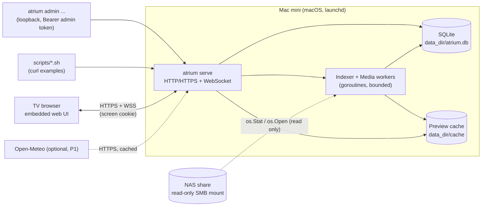
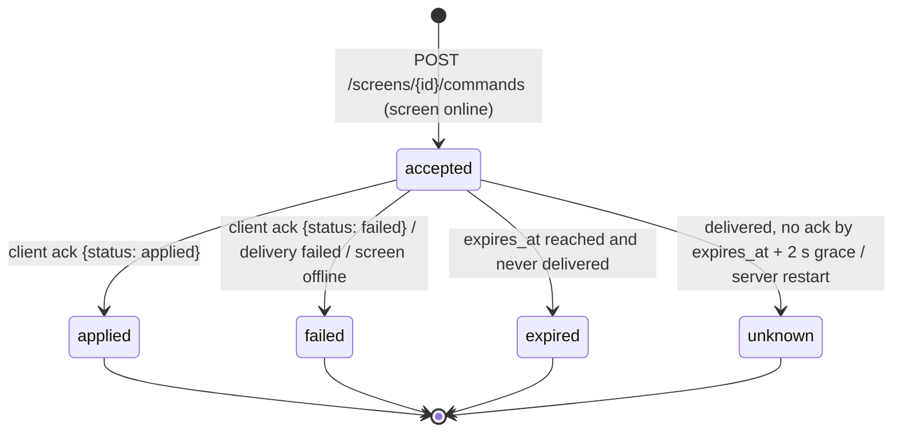

# Atrium Home Hub — Technical Design

| Item | Value |
| --- | --- |
| Project | Atrium |
| Document | Technical design for V1 base (V0.1 Screen → V0.2 NAS → V0.3 Realtime) |
| Version | 0.1 |
| Status | Approved for implementation; G0 hardware findings may amend marked sections |
| Created | 2026-09-05 |
| Source PRD | `docs/prd/2026-09/atrium-home-hub/prd.md` |
| Companion | `docs/plan/2026-09/atrium-home-hub/dev-plan.md` |

This document turns the PRD into an implementable architecture. It fixes the technology stack, module boundaries, data model, API and WebSocket contracts, background pipelines, security model and deployment shape. Anything the PRD leaves to G0 hardware verification is marked **[G0]** and has a documented default plus a fallback.

Priority of constraints when this document is ambiguous: PRD explicit rules > correctness and safety > product boundaries (read-only NAS, local-first, no AI dependency) > maintainability > performance > brevity.

## 1. Summary of decisions

| # | Decision | Chosen | Rejected alternatives | Why |
| --- | --- | --- | --- | --- |
| D1 | Core language / runtime | **Go 1.25+**, single static binary `atrium` | Python + FastAPI (PRD suggestion), Node.js | One binary makes launchd hosting, upgrade and rollback trivial; goroutines with `context` deadlines isolate NAS I/O and image decoding without a process pool; in-process WebSocket hub has shared memory, which removes the multi-process delivery problem the PRD flags for FastAPI; `embed` ships the web UI same-origin with no CDN; low idle memory for a 24/7 daemon. |
| D2 | Database | **SQLite via `modernc.org/sqlite`** (cgo-free), WAL mode, DB on Mac mini local disk | `mattn/go-sqlite3` (cgo), BoltDB, Postgres | Zero external service; reproducible cross-compile without a C toolchain; scale (≤ 10⁵ rows) is trivial for SQLite; `VACUUM INTO` gives consistent backups. |
| D3 | Web client | **React 18 + TypeScript + Vite**, static bundle embedded in the binary from `internal/webui/dist` | Svelte, vanilla TS, server-rendered HTML | Matches PRD; strong TS tooling; bundle targeted at `es2018` for TV engines; optional legacy build after G0. |
| D4 | Realtime transport | **WebSocket** (`github.com/coder/websocket`), JSON envelopes, `schema_version: 1` | SSE + POST, long polling | Bidirectional (heartbeat, ack) is required; one library, no framework. |
| D5 | Screen credential | **HttpOnly cookie** set at pairing claim, also accepted as `Authorization: Bearer` | localStorage token + first-message WS auth, signed media URLs | Cookie is sent automatically on `` requests and on the browser WebSocket handshake, so no credential ever appears in a URL (PRD 8.1). Bearer path keeps scripts, tests and a future TV shell simple. **[G0]** if a TV browser drops cookies, fallback is documented in §7.4. |
| D6 | Admin credential | **Bearer token only**, generated by `atrium init`, stored in `data_dir/admin.token` (mode 0600), hashed in DB | Cookie session + CSRF, mTLS | No browser admin UI in V1; a header-only credential cannot be replayed by a cross-site form, so no CSRF surface. |
| D7 | Transport security | **Local CA + server certificate generated by `atrium init`**; `tls.mode: auto | file | off` | Let's Encrypt (needs public DNS), plain HTTP | Works fully offline; `off` exists only for non-sensitive demos, and the server marks itself `insecure` in diagnostics. TV trust of the local CA is a **[G0]** checkpoint. |
| D8 | HEIC decoding | **`/usr/bin/sips` subprocess** (macOS built-in) converting to JPEG under a timeout; `heic.converter: sips | off` | libheif via cgo, Go pure decoders (none exist), skipping HEIC | Zero dependencies on the target platform; subprocess can be killed on hang. Orientation and capture time are re-read from the converted JPEG and from `sips -g` output. Real-sample validation is **[G0]**. |
| D9 | Metadata extraction | `github.com/evanoberholster/imagemeta` (JPEG/PNG/HEIC EXIF) behind a `media.MetadataReader` interface; `github.com/dsoprea/go-exif/v3` is the fallback if the former is unsuitable | `rwcarlsen/goexif` (no `OffsetTimeOriginal`) | Timezone-aware `captured_at` needs EXIF 2.31 offset tags. |
| D10 | Image resizing | `github.com/disintegration/imaging` (Lanczos, `AutoOrientation`) with stdlib `image/jpeg`, `image/png` | `golang.org/x/image/draw` only | Well-known API; output is re-encoded so previews carry no EXIF/GPS by construction. |
| D11 | Background work | **In-process goroutine workers** with bounded concurrency, `context` deadlines, a persistent SQLite job table, and a stuck-I/O detector that trips the source into `degraded` | Separate worker process, external queue | PRD forbids Redis/MQ; a persistent job table survives restarts; a stuck detector plus circuit breaker keeps API and heartbeats responsive when SMB hangs. Escalation to a supervised subprocess worker is pre-designed (§6.6) if G0 shows frequent kernel-level hangs. |
| D12 | CLI | `spf13/cobra`; the admin CLI talks to the running server over loopback HTTP with the admin token | Direct DB access from CLI | One code path for authorization and validation; scripts can use the same API. |
| D13 | Config | Single YAML file (`gopkg.in/yaml.v3`) with defaults and strict validation; state lives in SQLite, not in the config | TOML, env-only | Human-editable, comments allowed, no admin website required (PRD 4.1). |
| D14 | Logging | `log/slog` JSON to rotating files (`lumberjack`), 7-day retention, size cap; tokens and NAS paths are never logged at info level | Console only, syslog | PRD 8.3. |
| D15 | Routing | Custom minimal in-app router (state machine) in the web client; no `react-router` | react-router | Routes are a small whitelist and must be command-driven; a state machine is simpler to test and cannot be pushed to arbitrary URLs. |

## 2. System context



Trust boundaries:

- The LAN is not trusted. Every endpoint except `/health/*` and the pairing endpoints requires a credential.
- The TV never holds NAS credentials or paths. It only sees opaque photo IDs and preview bytes.
- The NAS is opened read-only. The code base has no write path to any source root; this is enforced by the `source.FS` interface, which exposes only `Stat`, `Open`, `ReadDir`, `Statfs`.
- The optional weather provider is the only outbound network dependency and is fully optional.

## 3. Repository layout

```
atrium/
├── cmd/atrium/main.go              # entrypoint → internal/cli
├── internal/
│   ├── app/                        # dependency wiring, lifecycle (Run, Shutdown)
│   ├── cli/                        # cobra commands: serve, init, admin, backup, restore, version
│   ├── config/                     # YAML loading, defaults, validation, redaction
│   ├── domain/                     # entities, enums, invariants, error codes (no I/O)
│   ├── store/                      # SQLite: open, migrations (embedded SQL), repositories
│   ├── auth/                       # token generation/hashing, pairing, middleware, origin checks, rate limits
│   ├── httpapi/                    # routes, handlers, DTOs, error mapping, SPA serving
│   ├── ws/                         # hub, session, protocol codec, heartbeat monitor
│   ├── screen/                     # screen registry, command service, sequencing, expiry, unknown resolution
│   ├── source/                     # FS abstraction, mount identity, health probe, stuck detector
│   ├── indexer/                    # scan scheduler, walker, stabilizer, removal rules, baseline
│   ├── media/                      # metadata reader, decoders (jpeg/png/heic-via-sips), preview generator, cache budget
│   ├── jobs/                       # persistent job queue, workers, backoff
│   ├── widget/                     # home snapshot composition, weather provider, notice
│   ├── clock/                      # timezone helpers, home-day computation
│   ├── backup/                     # VACUUM INTO, retention, restore
│   ├── diag/                       # diagnostics aggregation
│   └── webui/                      # SPA handler; embed.go + dist/ (copied from web/dist by `make web-sync`)
├── web/                            # Vite + React + TS client (fenced off the Go module by a stub go.mod)
│   ├── go.mod                      # stub module: keeps `go build ./...` out of web/node_modules
│   ├── dist/.gitkeep               # Vite outDir; copied to internal/webui/dist by `make web-sync`
│   ├── src/
│   │   ├── app/                    # bootstrap, providers, router state machine
│   │   ├── core/                   # api client, ws client, session, command executor, clock, auth-expiry
│   │   ├── screens/                # Pair, Connect, Dashboard, PhotoBrowser, PhotoView
│   │   ├── widgets/                # Clock, PhotoPane, NasStatus, Weather, Notice
│   │   ├── ui/                     # focus management, key mapping, status badge, layout primitives
│   │   └── types/                  # API/WS types generated by hand from §8/§9
│   ├── package.json, vite.config.ts, tsconfig.json
│   └── public/                     # favicon; no external assets
├── deploy/launchd/                 # com.atrium.core.plist template, install/uninstall scripts
├── scripts/                        # control and diagnostics scripts (bash + curl)
├── testdata/                       # generated sample images (no real photos)
├── docs/                           # prd, tech, plan, ops
├── config.example.yaml
├── Makefile
├── go.mod / go.sum
├── LICENSE (MIT), README.md, CONTRIBUTING.md, SECURITY.md
└── .gitignore, .editorconfig, .golangci.yml
```

Module dependency rule: `domain` imports nothing internal; `store` imports `domain`; services (`screen`, `indexer`, `media`, `widget`, `auth`) import `domain` and `store`; `httpapi`/`ws`/`cli` import services; `app` wires everything. Nothing imports `httpapi` except `app` and tests.

## 4. Runtime shape

### 4.1 Processes and goroutines

A single process `atrium serve` runs:

| Component | Concurrency | Notes |
| --- | --- | --- |
| HTTP server | net/http default pool | `ReadHeaderTimeout 10s`, `IdleTimeout 120s`; WS handlers hijack the connection. |
| WS hub | 1 goroutine per session for writes, 1 for reads; hub state guarded by a mutex | Bounded send queue per session (64 messages). |
| Heartbeat monitor | 1 goroutine, ticks every 5 s | Marks sessions offline after `offline_after` (45 s). |
| Command expirer | 1 goroutine, ticks every 1 s | `accepted` → `expired` or `unknown` per §6.5. |
| Scan scheduler | 1 goroutine per source | Serial, non-overlapping scans every `scan.interval`; manual scan requests coalesce into the next run. |
| Stabilizer | part of the scan goroutine | Re-stats candidates after `stability_interval`. |
| Job workers | `media.workers` (default 2) | Pull from the SQLite job table; each job runs under a context deadline (`decode_timeout`). |
| Health prober | 1 goroutine per source, every 15 s | Cheap `Stat` of the root plus identity check; feeds NAS status. |
| Cache janitor | 1 goroutine, every 10 min and after each preview write | Enforces `cache_budget_bytes` and `min_free_bytes`. |
| Widget refresher | 1 goroutine | Weather refresh on `refresh_interval`; marks stale after `stale_after`. |
| Backup scheduler | 1 goroutine | Daily `VACUUM INTO`, retention 7. |
| Log rotation | lumberjack | 7-day retention, `max_total_mb`. |

Every background goroutine is owned by `app.Runtime`, started after the store is migrated and stopped with a 10-second graceful shutdown on SIGTERM/SIGINT. Panics in workers are recovered, logged with a stack, counted in diagnostics and the worker is restarted with backoff.

### 4.2 Startup sequence

1. Load config, apply defaults, validate (fail fast with a readable message; secrets redacted in output).
2. Open `data_dir`, create subdirectories (`cache/`, `logs/`, `tls/`, `backups/`), verify permissions (`0700`).
3. Open SQLite, run migrations, `PRAGMA journal_mode=WAL`, `synchronous=NORMAL`, `foreign_keys=ON`, `busy_timeout=5000`. Every write transaction starts with `BEGIN IMMEDIATE` (`_txlock=immediate`) so a read→write upgrade can never fail with `SQLITE_BUSY_SNAPSHOT`; bulk writers (indexer) commit in batches of ≤ 200 rows; short writers retry on `SQLITE_BUSY` with jittered backoff.
4. Reconcile config-defined sources into `data_sources` (upsert by `id`; sources missing from config are marked `revoked` with reason `removed_from_config`; nothing is deleted).
5. Mark all `accepted` commands as `unknown` (`error_code = server_restart`). Mark all screens offline (sessions do not survive restart).
6. If the home timezone differs from `settings.home_timezone`, schedule `recompute_captured_day` and update the setting.
7. Start the HTTP server (TLS per config), then background goroutines.
8. Log a startup summary: version, listen address, TLS mode, data dir, source count, screen count, cache usage.

### 4.3 Shutdown sequence

Stop accepting connections → close WS sessions with code `1001` → cancel workers (jobs in `running` return to `queued`) → checkpoint WAL → close DB.

## 5. Data model (SQLite)

Migrations are embedded SQL files `internal/store/migrations/NNNN_name.sql`, applied in order and recorded in `schema_migrations`. All timestamps are stored as UTC RFC 3339 strings (`TEXT`) unless noted; the API always emits offsets. IDs are ULIDs unless the row has a natural key.

```sql
CREATE TABLE settings (
  key TEXT PRIMARY KEY,
  value TEXT NOT NULL,
  updated_at TEXT NOT NULL
);

CREATE TABLE data_sources (
  id TEXT PRIMARY KEY,                 -- from config, stable, [a-z0-9_]+
  name TEXT NOT NULL,
  root_path TEXT NOT NULL,             -- absolute path on the Mac mini (never sent to screens)
  status TEXT NOT NULL,                -- active | revoked
  revoked_at TEXT, revoke_reason TEXT,
  identity_bound TEXT,                 -- JSON: {fstype, mount_from_hash, marker} bound on first success
  identity_bound_at TEXT,
  health TEXT NOT NULL DEFAULT 'unknown',   -- online | offline | degraded | unknown
  health_detail TEXT,                  -- error code / short reason (no credentials)
  last_check_at TEXT, last_success_at TEXT,
  scan_generation INTEGER NOT NULL DEFAULT 0,     -- incremented per completed full scan
  last_scan_started_at TEXT, last_scan_completed_at TEXT,
  baseline_completed_at TEXT,          -- set when the first complete scan finishes
  share_total_bytes INTEGER, share_free_bytes INTEGER, share_stats_at TEXT,
  created_at TEXT NOT NULL, updated_at TEXT NOT NULL
);

CREATE TABLE photos (
  id TEXT PRIMARY KEY,
  source_id TEXT NOT NULL REFERENCES data_sources(id),
  rel_path TEXT NOT NULL,              -- relative to root, forward slashes, no '..'
  ext TEXT NOT NULL,                   -- lower-case without dot
  size_bytes INTEGER NOT NULL,
  mtime_unix INTEGER NOT NULL,
  fingerprint TEXT,                    -- sha256(size || mtime || head64k || tail64k), set at index time
  status TEXT NOT NULL,                -- pending | ready | removed | excluded | unsupported
  width INTEGER, height INTEGER, orientation INTEGER,
  captured_at TEXT,                    -- UTC; NULL when unknown
  captured_offset_seconds INTEGER,     -- original offset if known
  captured_confidence TEXT NOT NULL DEFAULT 'unknown',  -- exact | inferred | unknown
  captured_day TEXT,                   -- YYYY-MM-DD in home timezone; NULL when unknown
  first_seen_at TEXT NOT NULL,
  last_seen_at TEXT NOT NULL,
  last_seen_generation INTEGER NOT NULL,
  missing_generations INTEGER NOT NULL DEFAULT 0,
  is_baseline INTEGER NOT NULL DEFAULT 0,
  meta_status TEXT NOT NULL DEFAULT 'pending',      -- pending | ready | failed
  meta_error TEXT,
  preview_status TEXT NOT NULL DEFAULT 'pending',   -- pending | processing | ready | failed | evicted | unavailable
  preview_error TEXT, preview_attempts INTEGER NOT NULL DEFAULT 0, preview_next_retry_at TEXT,
  removed_at TEXT, excluded_at TEXT, exclude_reason TEXT,
  created_at TEXT NOT NULL, updated_at TEXT NOT NULL,
  UNIQUE (source_id, rel_path)
);
CREATE INDEX idx_photos_recent ON photos (first_seen_at DESC, id DESC) WHERE status = 'ready' AND is_baseline = 0;
CREATE INDEX idx_photos_day ON photos (captured_day) WHERE status = 'ready';
CREATE INDEX idx_photos_status ON photos (source_id, status);
CREATE INDEX idx_photos_preview ON photos (preview_status, preview_next_retry_at);

CREATE TABLE photo_exclusions (           -- survives rescans and rebuilds
  id TEXT PRIMARY KEY,
  source_id TEXT NOT NULL,
  match_kind TEXT NOT NULL,            -- path | prefix
  pattern TEXT NOT NULL,               -- rel_path or directory prefix
  reason TEXT, created_at TEXT NOT NULL,
  UNIQUE (source_id, match_kind, pattern)
);

CREATE TABLE preview_files (
  photo_id TEXT NOT NULL REFERENCES photos(id) ON DELETE CASCADE,
  variant TEXT NOT NULL,               -- preview | thumb
  rel_path TEXT NOT NULL,              -- relative to data_dir/cache
  bytes INTEGER NOT NULL, width INTEGER NOT NULL, height INTEGER NOT NULL,
  fingerprint TEXT NOT NULL,           -- source fingerprint the file was built from
  created_at TEXT NOT NULL, last_access_at TEXT NOT NULL,
  PRIMARY KEY (photo_id, variant)
);
CREATE INDEX idx_preview_lru ON preview_files (last_access_at);

CREATE TABLE jobs (
  id TEXT PRIMARY KEY,
  kind TEXT NOT NULL,                  -- extract_meta | build_preview | recompute_day | source_probe
  photo_id TEXT, source_id TEXT,
  status TEXT NOT NULL,                -- queued | running | done | failed
  priority INTEGER NOT NULL DEFAULT 0,
  attempts INTEGER NOT NULL DEFAULT 0,
  next_run_at TEXT NOT NULL,
  locked_by TEXT, locked_at TEXT,
  last_error TEXT,
  created_at TEXT NOT NULL, updated_at TEXT NOT NULL
);
CREATE UNIQUE INDEX idx_jobs_dedup ON jobs (kind, photo_id) WHERE status IN ('queued','running') AND photo_id IS NOT NULL;
CREATE INDEX idx_jobs_pick ON jobs (status, next_run_at, priority);

CREATE TABLE scan_runs (
  id TEXT PRIMARY KEY,
  source_id TEXT NOT NULL,
  mode TEXT NOT NULL,                  -- scheduled | manual | full
  status TEXT NOT NULL,                -- running | completed | failed | aborted
  started_at TEXT NOT NULL, finished_at TEXT,
  files_seen INTEGER DEFAULT 0, files_new INTEGER DEFAULT 0, files_changed INTEGER DEFAULT 0,
  files_missing INTEGER DEFAULT 0, files_removed INTEGER DEFAULT 0,
  files_unsupported INTEGER DEFAULT 0, errors INTEGER DEFAULT 0,
  note TEXT
);

CREATE TABLE screens (
  id TEXT PRIMARY KEY,                 -- slug chosen at approval, e.g. living_room_tv
  name TEXT NOT NULL,
  token_hash TEXT NOT NULL UNIQUE,     -- sha256 of the bearer token
  status TEXT NOT NULL,                -- active | revoked
  created_at TEXT NOT NULL, approved_at TEXT NOT NULL, revoked_at TEXT,
  last_seen_at TEXT, last_ip TEXT, client_version TEXT,
  current_route TEXT,                  -- JSON RouteState reported by the client
  last_sequence INTEGER NOT NULL DEFAULT 0,   -- last issued command sequence
  applied_sequence INTEGER NOT NULL DEFAULT 0 -- last sequence the client reported as applied
);

CREATE TABLE pairings (
  id TEXT PRIMARY KEY,
  code TEXT NOT NULL UNIQUE,           -- 6 digits, shown on the TV
  status TEXT NOT NULL,                -- pending | approved | claimed | expired | rejected
  client_hint TEXT, remote_ip TEXT,
  created_at TEXT NOT NULL, expires_at TEXT NOT NULL,
  approved_screen_id TEXT, approved_at TEXT, claimed_at TEXT
);

CREATE TABLE screen_commands (
  id TEXT PRIMARY KEY,
  screen_id TEXT NOT NULL REFERENCES screens(id),
  sequence INTEGER NOT NULL,
  kind TEXT NOT NULL,                  -- navigate | show | refresh
  payload TEXT NOT NULL,               -- JSON
  issued_by TEXT NOT NULL,             -- admin | token id
  issued_at TEXT NOT NULL, expires_at TEXT NOT NULL,
  status TEXT NOT NULL,                -- accepted | applied | failed | expired | unknown
  delivered_at TEXT, resolved_at TEXT,
  error_code TEXT, result TEXT,        -- result JSON: {route, resource_id, client_version}
  UNIQUE (screen_id, sequence)
);
CREATE INDEX idx_commands_open ON screen_commands (status, expires_at);

CREATE TABLE admin_tokens (
  id TEXT PRIMARY KEY,
  token_hash TEXT NOT NULL UNIQUE,
  label TEXT, created_at TEXT NOT NULL, revoked_at TEXT, last_used_at TEXT
);

CREATE TABLE widget_cache (
  widget TEXT PRIMARY KEY,             -- weather
  payload TEXT NOT NULL, fetched_at TEXT NOT NULL, expires_at TEXT NOT NULL, error TEXT
);

CREATE TABLE audit_log (               -- admin actions only; 7-day retention
  id TEXT PRIMARY KEY, at TEXT NOT NULL, actor TEXT NOT NULL, action TEXT NOT NULL, target TEXT, detail TEXT
);
```

Retention job (daily): delete `screen_commands`, `scan_runs`, `audit_log`, done/failed `jobs` older than 7 days; delete `pairings` older than 1 day.

What is derived vs. system state: `photos`, `preview_files`, `jobs`, `scan_runs`, `widget_cache` can be rebuilt from the NAS. `data_sources` identity/baseline, `photo_exclusions`, `screens`, `admin_tokens`, `settings` are system state and are covered by backups.

## 6. Core services

### 6.1 Source access and mount identity (`internal/source`)

```go
type FS interface {
    Stat(ctx context.Context, rel string) (fs.FileInfo, error)
    ReadDir(ctx context.Context, rel string) ([]fs.DirEntry, error)
    Open(ctx context.Context, rel string) (io.ReadSeekCloser, error) // read-only
    Statfs(ctx context.Context) (VolumeStats, error)                  // total/free bytes, fstype, mount_from
}
```

- `OSFS` implements it over `root_path`. Every call: reject `rel` containing `..`, absolute paths or NUL; resolve `filepath.Join(root, rel)`; `Lstat` first and refuse symlinks (never followed, counted as `skipped_symlink`).
- Every call runs with a deadline (`source.io_timeout`, default 20 s). Because a hung SMB syscall cannot be interrupted, the call executes in a helper goroutine; on deadline the caller returns `ErrStuck` and the helper is accounted in `stuck_ops`. A semaphore (`source.max_inflight`, default 8) caps leaked helpers; when the cap is reached the source becomes `degraded` and no new I/O is issued until a probe succeeds.
- **Identity**: on each probe, compute `identity = {fstype: statfs.Fstypename, mount_from_hash: sha256(statfs.Mntfromname)[:16], marker: <exists?>}`. Rules:
  - `identity.require_mount: true` (default): the filesystem that contains the root (per `Statfs` on the root path) must have `fstype` in `{smbfs, nfs, afpfs, webdav}` unless `identity.allow_local: true` (for development). The root may be any directory inside the share, not only the mount point; a missing mount yields `ENOENT` → `offline`, and a locally created stand-in directory yields `apfs` → `not_a_mount`.
  - Optional `identity.marker_file` must exist inside the root.
  - First successful probe **binds** the identity into `data_sources.identity_bound`. Later probes with a different identity set health `unknown`, detail `identity_mismatch`; scans are not run and nothing is removed until an admin runs `sources rebind-identity`.
- **Health** (`FR-07`): `online` (probe OK, identity matches), `offline` (root missing, `ENOENT`, `ENOTCONN`, `EHOSTDOWN`, mount absent), `degraded` (probe OK but recent I/O errors/timeouts above threshold, or `EACCES` on some entries), `unknown` (identity mismatch, probe timed out, or never probed). Each transition records `last_check_at`, success records `last_success_at`; transitions publish `data.changed{nas}`.
- Share capacity (`FR-12`, P1): `Statfs` total/free bytes stored on the source and shown as "share free space" only when `fstype` is a network filesystem and values are non-zero.

### 6.2 Indexer (`internal/indexer`)

Scan loop per source (serial, non-overlapping):

1. Skip when health is not `online` (log once per transition).
2. Create `scan_runs` row (`running`), `generation = scan_generation + 1` (not yet committed to the source).
3. Walk the root breadth-first with `ReadDir`, applying exclusions (`photo_exclusions` prefix rules) and the extension allowlist. Files that match neither are ignored; supported-looking files with unsupported content (decode failure with `unsupported`) count toward `files_unsupported` and are stored with `status = unsupported` so they appear in diagnostics.
4. For each candidate `(rel_path, size, mtime)`:
   - Existing row with same size and mtime → `last_seen_at/generation` updated, `missing_generations = 0`.
   - Existing row with changed size/mtime → mark `changed`; go through stability again; on stable, reset `meta_status/preview_status` to `pending`, invalidate `preview_files` (fingerprint changes), enqueue jobs.
   - New path → add to the in-memory **stability set** with the observation. A path is indexed only after `stability_checks` (default 2) consecutive identical observations at least `stability_interval` (default 5 s) apart; the scan goroutine sleeps `stability_interval` at the end of the walk and re-stats the stability set, up to `stability_max_rounds` (default 3) rounds; unresolved candidates carry over to the next scan.
   - Newly indexed rows: `status = pending`, `first_seen_at = now`, `is_baseline = (source.baseline_completed_at IS NULL)`, `last_seen_generation = generation`; enqueue `extract_meta` (priority 10) then `build_preview` (priority 5, chained after meta succeeds).
5. When the walk completes without error and identity is still confirmed, the run is `completed`: commit `scan_generation = generation`, set `last_scan_completed_at`, set `baseline_completed_at` if unset (baseline import finished). Rows whose `last_seen_generation < generation` get `missing_generations += 1`; rows with `missing_generations >= 2` and status `ready|pending` become `removed` (`removed_at = now`), their `preview_files` are deleted from disk, `data.changed{photos}` is published. A run that fails or aborts (identity change, offline, stuck cap) is marked `failed|aborted` and **does not** increment the generation or any `missing_generations` (FR-08: scan failure never mass-deletes).
6. If a path previously `removed` reappears, the same row is revived: `status = pending`, `first_seen_at = now`, `is_baseline = 0`, `missing_generations = 0` (a genuine new discovery event).
7. A manual scan request (`POST /sources/{id}/scan`) sets a flag; if a scan is running, the request returns that run (`merged: true`); otherwise the loop wakes immediately. `mode = full` additionally clears the stability set and forces a re-stat of all rows.
8. Progress: the `scan_runs` counters are updated every 200 files; `GET /api/v1/home` exposes `index.state = idle | scanning | baseline_import` and `progress = {seen, indexed, pending_preview}`.

Scan budget: if a scan exceeds `scan.interval`, the next start is delayed until completion plus 5 s; diagnostics expose `last_scan_duration` so G0 can decide on partitioned scanning (§13).

Timezone changes: `recompute_day` job recomputes `captured_day` for all rows with `captured_at` from `captured_at` and the new home timezone in batches of 500.

### 6.3 Media pipeline (`internal/media`)

Jobs are processed by `jobs.Worker` with a per-job context deadline (`media.decode_timeout`, default 30 s), `media.workers` in parallel, `media.max_pixels` (default 80 MP) and `media.max_source_bytes` (default 60 MB) guards checked via `image.DecodeConfig` before a full decode.

`extract_meta`:

1. Open the file read-only; read the header (up to 1 MB for JPEG/PNG; HEIC handled by the converter step below).
2. `MetadataReader.Read` → `{DateTimeOriginal, OffsetTimeOriginal, DateTime, Orientation, Width, Height}`.
3. `captured_at` resolution: `DateTimeOriginal + OffsetTimeOriginal` → `exact`; `DateTimeOriginal` without offset → interpret in the home timezone, `inferred`; neither → `unknown`, `captured_at NULL`. Never use file mtime. Values outside `[1970, now + 1 day]` are `unknown` with `meta_error = implausible_datetime`.
4. `captured_day` = date of `captured_at` in the home timezone (`clock.HomeDay`).
5. Fingerprint: `sha256(size, mtime, first 64 KiB, last 64 KiB)`.
6. Write `meta_status = ready`, then enqueue `build_preview`.

`build_preview`:

1. Guard: NAS `online`, photo `status in (pending, ready)`, not excluded, free disk ≥ `min_free_bytes`, cache under budget (otherwise leave job `queued` with `next_run_at = +2 min`).
2. Decode: JPEG/PNG via `imaging.Decode(r, imaging.AutoOrientation(true))`; HEIC via `sips -s format jpeg --resampleHeightWidthMax <preview_max_edge> <src> --out <tmp>` under the job deadline (process killed on timeout), then decode the tmp JPEG the same way. **[G0]** confirm that `sips` output orientation is correct on real samples; if not, apply `orientation` read by `MetadataReader` manually.
3. Produce `preview` (long edge ≤ `preview_max_edge` = 2560, JPEG quality 85, re-encode at 75/65 if bytes > `preview_max_bytes`) and `thumb` (long edge ≤ 480, quality 80). Write to `cache/<variant>/<id[0:2]>/<id[2:4]>/<id>.jpg` via temp file + rename. Re-encoding drops all EXIF/GPS.
4. Update `preview_files` and `photos.preview_status = ready`, `status = ready` (if it was `pending`), publish `data.changed{photos}` (coalesced).
5. Failure handling: decode error → `preview_attempts += 1`, `preview_next_retry_at` per backoff `1m, 5m, 30m, 6h`, `preview_status = failed` after 5 attempts (`preview_error` keeps the code: `decode_failed`, `unsupported`, `too_large`, `timeout`, `io_error`, `stuck`). Files that fail with `unsupported` set `photos.status = unsupported` and never re-enter the slideshow until a `full` scan or manual `photos retry`.

Cache budget janitor:

- Sum of `preview_files.bytes` vs `cache_budget_bytes`. Over budget → evict by `last_access_at` ascending (thumb and preview independently) until ≤ 90 %. Evicted rows: delete file, delete `preview_files` row, set `photos.preview_status = evicted` (index is kept, FR-10 / §5.2 rule).
- A media request for an `evicted` photo enqueues `build_preview` (dedup index prevents duplicates) and returns `202 processing`; if NAS is offline it returns `503 preview_unavailable`.
- `last_access_at` is updated at most once per hour per file (in-memory throttle) to keep writes low.
- If disk free < `min_free_bytes`, new preview jobs are paused and diagnostics show `cache.paused_reason = low_disk`.

### 6.4 Photo collections (`internal/httpapi` + `internal/store`)

Eligibility for screens: `photos.status = 'ready' AND source.status = 'active'`. Items always carry `preview.status`; the client skips items that are not `ready`.

| Collection | Query | Cursor |
| --- | --- | --- |
| `recent` | `is_baseline = 0` ordered by `first_seen_at DESC, id DESC` | keyset `(first_seen_at, id)` base64 |
| `captured_today` | `captured_day = HomeDay(now)` ordered by `captured_at ASC, id ASC`; `meta.unknown_captured_count` = ready photos with `captured_confidence = unknown` | keyset |
| `random` | eligible IDs shuffled with a per-round seed (`seed` query, default random); server loads IDs (≤ 100 k) and shuffles with `math/rand/v2` PCG seeded by `seed` | `seed:offset`; `next_cursor` is null at round end so the client starts a new round with a new seed |
| `all` | `captured_at DESC NULLS LAST, id DESC` (for the browser grid) | keyset |

`limit` default 50, max 100. `GET /api/v1/photos/{id}` returns one item; `?neighbors=collection` optionally returns previous/next IDs within that collection for the photo viewer.

### 6.5 Screens, sessions and commands (`internal/screen`, `internal/ws`)

**Identity vs. presence**: a screen is `registered` when approved and not revoked. It is `online` when it has exactly one active WS session whose last heartbeat is within `offline_after` (45 s). The hub allows one session per screen: a new authenticated connection supersedes the previous one (old session closed with `4003 superseded`), so the same device with two tabs never executes twice.

**Command lifecycle** (`FR-13`–`FR-16`):



- Validation: `navigate.payload = {route: dashboard | photos, collection?: recent | captured_today | random | all}`; `show.payload = {photo_id}` where the photo must be eligible and `preview_status = ready`; `refresh.payload = {}`. Invalid → `400 invalid_command`.
- Screen not registered → `404`. Screen offline → command is persisted with `status = failed`, `error_code = screen_offline` and the API returns `409` with the command body (nothing is queued, PRD 5.3).
- Sequence: within one transaction `screens.last_sequence += 1` becomes the command's `sequence`.
- Delivery: hub `Send(screen_id, msg)`; if the session queue is full or closed → `failed / delivery_failed`.
- Client rule: apply only if `sequence > applied_sequence`; otherwise ack `failed / superseded`. Duplicate `command_id` is ignored (idempotent). The client never evaluates `expires_at` with its own clock; the server owns expiry.
- Ack: `{command_id, status: applied | failed, route, resource_id?, error_code?}` → server sets terminal status once; later acks for a terminal command are ignored and logged at debug.
- `unknown`: the resolver never flips the status automatically. It attaches `result.observed = {applied_sequence, route}` from the next heartbeat so the operator can decide. CLI prints this as "unknown (screen reports sequence N on route X)".
- Restart: all `accepted` → `unknown / server_restart` at startup (§4.2).

**Heartbeat and state**: clients send `heartbeat` every 15 s with `{route, applied_sequence, client_version}`; the server updates `screens.last_seen_at`, `current_route`, `applied_sequence` and replies `heartbeat.ack {server_time}`. Route changes triggered by the remote are reported immediately with `state`.

**Revocation**: `DELETE /screens/{id}` sets `revoked`, closes the session with `4002 revoked`, and deletes the pairing history. The client clears everything and shows the pairing page.

### 6.6 Escalation path for hung NAS I/O (pre-designed, not built in V1)

If G0 shows that SMB syscalls hang for minutes and leak too many helper goroutines, the media/indexer workers move into `atrium worker` subprocesses supervised by the core over stdin/stdout JSON lines. The `source.FS` and `jobs.Worker` interfaces are the seam; nothing in HTTP/WS layers changes.

### 6.7 Widgets (`internal/widget`)

`GET /api/v1/home` is composed from cheap in-memory/DB reads (no NAS I/O on the request path):

| Widget | Payload | Stale rule |
| --- | --- | --- |
| `clock` | `{timezone, server_time, utc_offset_seconds, next_offset_change_at?}` | never |
| `photo` | `{slideshow_interval_seconds, totals: {ready, pending_preview, unsupported}, new_today, captured_today, unknown_captured, baseline: {status: importing | done | none, completed_at}, index: {state, progress, last_scan_at}}` | never |
| `nas` | `{sources: [{id, name, health, last_check_at, last_success_at, share_free_bytes?, share_total_bytes?}]}` | never (health carries its own timestamps) |
| `weather` (P1, optional) | `{provider, location_label, temperature_c, condition_code, condition_text, fetched_at, stale}` | `stale` when `fetched_at` older than `stale_after` (2 h); hidden when disabled or never fetched |
| `notice` (P1, optional) | `{text, updated_at}` | hidden when empty |

Widget types are a closed whitelist; unknown types are not emitted, and the client hides types it does not know. Weather provider: Open-Meteo forecast API (no API key) with `latitude/longitude` from config; failures keep the last payload and set `error` in diagnostics.

### 6.8 Pairing and authentication (`internal/auth`)

Pairing (TV shows the code, operator approves on the Mac mini):

1. TV `POST /api/v1/pair/start {client_hint}` → `{pairing_id, code, expires_at, poll_interval_ms: 3000}`. Rate limit: 5/min per IP, 20/min global. Code: 6 digits from `crypto/rand`, unique among pending pairings, TTL 5 min, single use.
2. Operator `atrium admin pair approve <code> --name "Living room TV" --id living_room_tv` → `POST /api/v1/pairings/{id}/approve` (admin). Creates the `screens` row (with a placeholder hash) and marks the pairing `approved`; the credential itself is minted at claim time so no unclaimed plaintext token ever exists at rest or in memory.
3. TV polls `GET /api/v1/pair/{pairing_id}` (rate limit 60/min per pairing). On `approved`, TV `POST /api/v1/pair/{pairing_id}/claim` mints the screen token, stores its hash, and the response sets cookie `atrium_screen=<token>; HttpOnly; SameSite=Strict; Path=/; Max-Age=31536000; Secure` (Secure omitted only when `tls.mode = off`) and returns `{screen_id, name, token}` (the token body is for non-browser clients). The pairing becomes `claimed`; a second claim returns `410`.
4. Failed/expired pairings are listed by `atrium admin pair list`; `pair reject <id>` removes one.

Token format: `atr_scr_<43 base64url chars>` / `atr_adm_<43 chars>` (32 random bytes). Only `sha256(token)` is stored. Lookup by hash, so comparison is constant-time by construction.

Authorization scopes:

| Scope | How | Allowed |
| --- | --- | --- |
| `screen` | cookie **or** Bearer `atr_scr_*` | `GET /home`, `GET /photos*`, `GET /media/*`, `GET /nas/status` (summary), `GET /screens/me`, WS connect |
| `admin` | Bearer `atr_adm_*` only (cookies are never accepted for admin routes) | everything, including screen routes |
| none | — | `/health/live`, `/health/ready`, `/api/v1/pair/*`, static assets |

Origin policy: every WS handshake from a browser carries an `Origin`, which must be in `server.allowed_origins` (default: the origin of `server.public_url`, plus `https://localhost:<port>` and `https://127.0.0.1:<port>`). Cookie-authenticated HTTP requests must prove their provenance by one of: an allowed `Origin`; `Sec-Fetch-Site: same-origin` or `none` (browsers omit `Origin` on same-origin GET fetches, `` loads and navigations); or, for engines without fetch metadata, a `Referer` whose origin is allowed. `Sec-Fetch-Site: cross-site|same-site` and requests with none of the three are refused. Requests without any provenance are only honoured with Bearer auth. Cookie auth is never accepted on non-GET routes (defense in depth; there are none by design).

Auth failure rate limit: 10 failures/min per IP → `429` for 60 s. All rate limiters are `golang.org/x/time/rate` keyed in an LRU map.

Admin token file: `data_dir/admin.token`, created by `atrium init` (0600). CLI resolution order: `--token`, `ATRIUM_ADMIN_TOKEN`, token file in `--data-dir`/config. `atrium admin token rotate` issues a new token, revokes the old one after the response is written, and rewrites the file. `atrium token reset` (offline, server stopped) regenerates it directly in the DB for lockout recovery.

### 6.9 TLS (`atrium init`)

- `tls.mode = auto`: on first run generate `tls/ca.crt`, `tls/ca.key` (ECDSA P-256, 10 years), `tls/server.crt`, `tls/server.key` (2 years, SANs = IPs and hostnames from `server.public_url`, `server.extra_sans`, `localhost`, `127.0.0.1`). `atrium tls renew` regenerates the server cert; `atrium tls export-ca` prints the CA certificate for installation on the TV. **[G0]** documents how the target TV trusts it.
- `tls.mode = file`: use provided cert/key.
- `tls.mode = off`: HTTP only; startup logs a warning, diagnostics expose `insecure: true`, cookies drop `Secure`, and the web UI shows a small "insecure demo mode" tag.

### 6.10 Backup and restore (`internal/backup`)

- Daily at `backup.time` (default 03:00 home time) when `backup.enabled` and `backup.dir` is set (must not be inside a source root; validated): `VACUUM INTO '<dir>/atrium-YYYYMMDD-HHMMSS.db'` plus a copy of the config file (with secrets redacted only if the config contains any; V1 config has none). Keep the newest `backup.keep` (7).
- `atrium backup now`, `atrium backup list`, `atrium restore --from <file>` (server must be stopped; the current DB is moved aside as `atrium.db.pre-restore-<ts>` rather than deleted).
- Cache is never backed up; previews regenerate on demand.

### 6.11 Diagnostics and logging (`internal/diag`)

`GET /api/v1/diagnostics` (admin) and `atrium admin diag`:

```json
{
  "version": "0.1.0+abc1234", "uptime_seconds": 1234, "insecure": false,
  "db": {"path_redacted": true, "size_bytes": 0, "wal_bytes": 0, "migrations": 3},
  "sources": [{"id": "family_photos", "health": "online", "identity_bound": true, "last_success_at": "…", "last_scan": {"status": "completed", "duration_ms": 0, "files_seen": 0}, "stuck_ops": 0}],
  "photos": {"ready": 0, "pending": 0, "unsupported": 0, "removed": 0, "excluded": 0, "preview_failed": 0, "preview_evicted": 0},
  "jobs": {"queued": 0, "running": 0, "failed": 0, "oldest_queued_at": null},
  "cache": {"bytes": 0, "budget_bytes": 0, "free_disk_bytes": 0, "paused_reason": null},
  "screens": [{"id": "living_room_tv", "online": true, "last_seen_at": "…", "route": {"name": "dashboard"}, "applied_sequence": 0, "open_commands": 0}],
  "commands": {"last_24h": {"applied": 0, "failed": 0, "expired": 0, "unknown": 0}},
  "widgets": {"weather": {"enabled": false, "fetched_at": null, "stale": true, "error": null}},
  "recent_errors": [{"at": "…", "component": "media", "code": "decode_failed", "photo_id": "…"}]
}
```

Logging rules: JSON lines via `slog`; fields `component`, `event`, `code`, and IDs. Never log tokens, cookies, the `Authorization` header, NAS `root_path`, `rel_path` or `mount_from` at `info` or above. `debug` may include `rel_path` and is off by default. Log files: `logs/atrium.log`, rotated at 20 MB, `retain_days: 7`, `max_total_mb: 200`.

## 7. Web client design (`web/`)

### 7.1 Screens and routes

| Route | Purpose | Entered by |
| --- | --- | --- |
| `pair` | shows the 6-digit code and instructions; polls pairing status | no credential, or `401` on any request |
| `connect` | Core unreachable and nothing cached, or auth cache expired (> 24 h) | connection state machine |
| `dashboard` | clock, photo pane (slideshow), status bar, optional widgets | default, Back key, cold start, `navigate` |
| `photos/:collection` | browse a collection (focusable strip/grid) | Left/Right from dashboard, `navigate` |
| `photo/:id` | single photo, slideshow paused | Enter on an item, `show` |

Remote keys: `ArrowLeft/Right/Up/Down`, `Enter`, `Escape`/`Backspace` and TV back codes (`keyCode 461` webOS, `10009` Tizen, `KEY_BACK`/`GoBack` in Android TV WebView). Focus is always visible (outline + scale), never colour-only.

### 7.2 State machines

- **Connection**: `idle → connecting → online → reconnecting → online | offline`. Reconnect uses exponential backoff with full jitter from 1 s to 30 s; each attempt first calls `GET /api/v1/home` (auth + snapshot) then opens the WS; on `401` → `pair`; on `4002 revoked` → clear and `pair`; on `4003 superseded` → stop reconnecting and show "another session is active" on the connect screen.
- **Router**: `{name, params}` plus `appliedSequence`. Command execution: validate → set route → after the target screen reports `rendered` (image `onload` for `show`, first paint effect for routes) → send `command.ack applied` with `route` and `resource_id`; on missing photo/route → `ack failed` with `error_code`. The slideshow runs only on `dashboard`; `show` pauses it until Back, another command, or a manual photo change; `refresh` re-fetches data for the current route and keeps the paused state.
- **Clock**: on every `home` response and heartbeat ack, compute `offset = server_time - Date.now()`; tick locally every second; format with `Intl.DateTimeFormat(undefined, {timeZone})` when supported, otherwise with `utc_offset_seconds` from the clock widget. If no server time has been received for 6 h, show a small "time unverified" badge (FR-02).
- **Auth cache expiry (PRD 8.2)**: persist `lastAuthOkAt` (updated on every successful authenticated response). On boot, on resume from `visibilitychange`, and every 60 s: if `now - lastAuthOkAt > 24 h`, purge in-memory photo lists, stop rendering images, navigate to `connect`, and only resume after a successful re-authentication.

### 7.3 Data flow

- Initial: `GET /home` → render dashboard; `GET /photos?collection=random` for the slideshow; WS connect → `session.ready`.
- `data.changed{topics}` → throttled (1 s) re-fetch of `home` and the active collection.
- Images are loaded via `` (cookie auth). `202` → retry after 5 s (max 3) then skip; `404/410` → drop from the list; `503` → skip for this round.
- Preloading: the next slideshow image is fetched one interval ahead; at most two decoded images are kept.

### 7.4 Fallback if the TV browser drops cookies **[G0]**

Enable `client.auth_mode = bearer` in the build: store the claimed token in `localStorage`, send it as `Authorization` on fetches, authenticate the WS with a first message `{type: "auth", token}` within 5 s of connect, and load images through `fetch` + `URL.createObjectURL`. The server already supports Bearer and can accept the first-message auth by adding one handler; the design keeps this as an additive change.

### 7.5 Build and compatibility

- Vite `build.target = es2018`, no top-level await, no `??=`; CSS uses flex/grid only; `@vitejs/plugin-legacy` is enabled only if G0 finds an engine that needs it.
- Fonts: system stack (`system-ui, -apple-system, "Segoe UI", Roboto, "Noto Sans", sans-serif`); no external requests at all.
- Layout: 1920×1080 base with `vw/vh` units and a `min` text size of 32 px for primary info; 4K is handled by the same layout with device pixel ratio.
- Assets are served with `Cache-Control: public, max-age=31536000, immutable` for hashed files and `no-cache` for `index.html`.
- `client_version` = `package.json` version + short git SHA injected at build; the server logs it per session.

## 8. HTTP API contract (`/api/v1`)

Conventions: JSON; timestamps as RFC 3339 with offset; errors as `{"error": {"code": "...", "message": "...", "details": {}}}`; pagination `?cursor=&limit=`. The full OpenAPI document lives at `docs/api/openapi.yaml` (generated by hand in V0.1 and kept in sync by tests that assert route registration).

| Method & path | Auth | Purpose | Notes |
| --- | --- | --- | --- |
| `GET /health/live` | none | process alive | `{status: "ok"}` |
| `GET /health/ready` | none | DB reachable | `200` / `503`; no home data |
| `POST /api/v1/pair/start` | none | begin pairing | rate limited |
| `GET /api/v1/pair/{id}` | none | pairing status | `pending / approved / claimed / expired` |
| `POST /api/v1/pair/{id}/claim` | none | claim credential | sets cookie, returns token |
| `GET /api/v1/home` | screen/admin | dashboard snapshot | §6.7 |
| `GET /api/v1/photos` | screen/admin | list by collection | §6.4 |
| `GET /api/v1/photos/{id}` | screen/admin | single item | `?neighbors=<collection>` |
| `GET /api/v1/media/photos/{id}` | screen/admin | preview bytes | `?variant=preview|thumb`; `200 image/jpeg`, `202 processing` (JSON, `Retry-After: 5`), `404`, `503 preview_unavailable`; `ETag = fingerprint` |
| `GET /api/v1/nas/status` | screen/admin | source health | admin sees `health_detail`, share stats, stuck ops |
| `GET /api/v1/screens/me` | screen | own record | |
| `GET /api/v1/screens` | admin | screens with online state | |
| `GET /api/v1/screens/{id}` | admin | one screen | |
| `DELETE /api/v1/screens/{id}` | admin | revoke | closes session |
| `POST /api/v1/screens/{id}/commands` | admin | issue command | `202` with command; `409 screen_offline` |
| `GET /api/v1/commands/{id}` | admin | command result | |
| `GET /api/v1/commands?screen_id=&status=&limit=` | admin | recent commands | |
| `GET /api/v1/pairings` | admin | list pairings | |
| `POST /api/v1/pairings/{id}/approve` | admin | `{screen_id, name}` | |
| `DELETE /api/v1/pairings/{id}` | admin | reject | |
| `GET /api/v1/sources` | admin | sources with diagnostics | |
| `POST /api/v1/sources/{id}/scan` | admin | `{mode: incremental|full}` → `scan_run` | merges into a running scan |
| `POST /api/v1/sources/{id}/revoke` | admin | hide all photos of a source | keeps index; publishes `photos` change |
| `POST /api/v1/sources/{id}/restore` | admin | undo revoke | only for sources still in config |
| `POST /api/v1/sources/{id}/rebind-identity` | admin | accept the current mount identity | |
| `GET /api/v1/scans/{id}` / `GET /api/v1/scans?source_id=` | admin | scan runs | |
| `GET /api/v1/photos/{id}/admin` | admin | item with `rel_path`, errors | the only route that reveals a path |
| `POST /api/v1/photos/{id}/exclude` / `include` | admin | per-photo authorization | writes `photo_exclusions` |
| `POST /api/v1/photos/{id}/retry` | admin | requeue meta/preview | |
| `GET /api/v1/exclusions` / `POST` / `DELETE /{id}` | admin | manage prefix/path rules | |
| `GET /api/v1/diagnostics` | admin | §6.11 | |
| `POST /api/v1/admin/token/rotate` | admin | new admin token | |
| `POST /api/v1/backups` / `GET /api/v1/backups` | admin | backup now / list | |
| `GET /api/v1/screens/connect` | screen | WebSocket upgrade | §9 |

Error codes (stable strings): `unauthorized`, `forbidden`, `not_found`, `invalid_request`, `invalid_command`, `screen_offline`, `screen_revoked`, `pairing_expired`, `pairing_claimed`, `rate_limited`, `preview_processing`, `preview_unavailable`, `source_offline`, `identity_mismatch`, `conflict`, `internal`.

Photo item DTO:

```json
{
  "id": "01J...",
  "source_id": "family_photos",
  "captured_at": "2026-09-05T10:12:00+08:00",
  "captured_confidence": "exact",
  "first_seen_at": "2026-09-05T02:15:03Z",
  "is_baseline": false,
  "width": 4032, "height": 3024,
  "preview": {"status": "ready", "width": 2560, "height": 1920},
  "urls": {"preview": "/api/v1/media/photos/01J...?variant=preview", "thumb": "/api/v1/media/photos/01J...?variant=thumb"}
}
```

## 9. WebSocket protocol (`/api/v1/screens/connect`)

Envelope for both directions:

```json
{"schema_version": 1, "type": "screen.command", "id": "msg_01J...", "sent_at": "2026-09-05T13:00:00Z", "payload": {}}
```

Server → client:

| type | payload | notes |
| --- | --- | --- |
| `session.ready` | `{screen: {id, name}, server_time, home_version, pending_command?: Command}` | first message after auth; `pending_command` is the newest `accepted` command not yet delivered, if still unexpired |
| `screen.command` | `{command_id, sequence, kind, payload, issued_at, expires_at}` | `kind = navigate | show | refresh` |
| `data.changed` | `{topics: ["home","photos","nas"], version}` | coalesced 250 ms per session; queue-overflow safe (dropped duplicates) |
| `heartbeat.ack` | `{server_time}` | |
| `session.revoked` | `{reason}` | followed by close `4002` |
| `session.superseded` | `{}` | followed by close `4003` |

Client → server:

| type | payload |
| --- | --- |
| `heartbeat` | `{route: RouteState, applied_sequence, client_version}` every 15 s |
| `state` | `{route: RouteState}` on route change |
| `command.ack` | `{command_id, status: applied | failed, route: RouteState, resource_id?, error_code?}` |

`RouteState = {name: "dashboard" | "photos" | "photo" | "pair" | "connect", collection?: string, photo_id?: string}`.

Close codes: `1000` normal, `1001` server shutdown, `4001` unauthorized, `4002` revoked, `4003` superseded, `4004` send-queue overflow, `4005` protocol error. Messages larger than 64 KiB are rejected with `4005`.

## 10. Configuration

`config.example.yaml` (all keys, with defaults):

```yaml
home:
  name: "Home"
  timezone: "Asia/Singapore"          # IANA; required; do not infer a location from it
server:
  listen: "0.0.0.0:8443"
  public_url: "https://192.168.1.10:8443"   # origin the TV will open; used for Origin checks and TLS SANs
  extra_sans: []                      # e.g. ["macmini.local"]
  allowed_origins: []                 # defaults to the origin of public_url + localhost variants
  tls:
    mode: "auto"                      # auto | file | off (off = insecure demo only)
    cert_file: ""
    key_file: ""
storage:
  data_dir: "~/Library/Application Support/Atrium"
  cache_budget_bytes: 10737418240     # 10 GiB
  min_free_bytes: 5368709120          # pause previews below 5 GiB free
sources:
  - id: "family_photos"
    name: "Family photos"
    root: "/Volumes/photos/family"    # read-only mount; never scanned outside this root
    include_extensions: ["jpg", "jpeg", "png", "heic", "heif"]
    identity:
      require_mount: true             # root must be on a network filesystem distinct from its parent
      allow_local: false              # development only
      marker_file: ""                 # optional file that must exist inside root
    scan:
      interval: "60s"
      stability_interval: "5s"
      stability_checks: 2
      stability_max_rounds: 3
    io_timeout: "20s"
    max_inflight: 8
media:
  workers: 2
  decode_timeout: "30s"
  preview_max_edge: 2560
  preview_max_bytes: 1048576
  thumb_max_edge: 480
  max_pixels: 80000000
  max_source_bytes: 62914560
  heic:
    converter: "sips"                 # sips | off
screens:
  heartbeat_interval: "15s"
  offline_after: "45s"
  command_ttl: "10s"
  slideshow_interval: "30s"
widgets:
  weather:
    enabled: false
    provider: "open-meteo"
    latitude: 0
    longitude: 0
    location_label: ""
    refresh_interval: "30m"
    stale_after: "2h"
  notice:
    enabled: false
    text: ""
logging:
  level: "info"                       # debug | info | warn | error
  retain_days: 7
  max_total_mb: 200
backup:
  enabled: false
  dir: ""                             # must be outside every source root and outside data_dir
  time: "03:00"
  keep: 7
```

Validation rejects: missing timezone, unknown timezone, duplicate source IDs, source root equal to `/`, `data_dir` inside a source root, `backup.dir` inside a source root or `data_dir`, `tls.mode = file` without files. Environment overrides: `ATRIUM_CONFIG` (path), `ATRIUM_DATA_DIR`, `ATRIUM_ADMIN_TOKEN` (CLI only).

## 11. CLI surface

```
atrium init      [--config path] [--data-dir path] [--public-url url]   # writes config if missing, data dir, TLS, admin token
atrium serve     [--config path]
atrium version
atrium tls       renew | export-ca
atrium backup    now | list
atrium restore   --from file
atrium token     reset                                             # offline recovery

atrium admin [--url https://127.0.0.1:8443] [--token ...] [--json]
  diag
  pair     list | approve <code> --id <slug> --name <name> | reject <id>
  screens  list | get <id> | revoke <id>
  screen   navigate <screen> --route dashboard|photos [--collection ...] [--wait]
           show <screen> --photo <id> [--wait]
           refresh <screen> [--wait]
  commands get <id> | list [--screen id] [--status s]
  sources  list | scan <id> [--full] | revoke <id> | restore <id> | rebind-identity <id>
  scans    list [--source id] | get <id>
  photos   get <id> | exclude <id> [--reason r] | include <id> | retry <id> | list --collection c [--limit n]
  exclusions list | add --source id --prefix dir/ | remove <id>
  token    rotate
```

`--wait` polls `GET /commands/{id}` every 250 ms until terminal or 15 s and exits non-zero unless `applied`. The admin CLI defaults to the loopback URL and trusts `tls/ca.crt` from the data dir automatically.

`scripts/` ships `screen-navigate.sh`, `screen-show.sh`, `screen-refresh.sh`, `command-get.sh`, `screens-list.sh` as plain `curl` examples for FR-18, reading `ATRIUM_URL` and `ATRIUM_ADMIN_TOKEN`.

## 12. Deployment on macOS

- LaunchAgent `~/Library/LaunchAgents/com.atrium.core.plist`: `ProgramArguments = [/usr/local/bin/atrium, serve, --config, <path>]`, `RunAtLoad`, `KeepAlive`, `ThrottleInterval 5`, `StandardOutPath/StandardErrorPath` under `data_dir/logs/`, `WorkingDirectory = data_dir`. Installed by `deploy/launchd/install.sh`, which substitutes paths and runs `launchctl bootstrap gui/$UID`.
- LaunchAgent semantics (PRD 8.3): the service starts after the user logs in; auto-login or a LaunchDaemon are deployment choices recorded in G0, not code defaults. The NAS mount must exist in the same user session; `deploy/README.md` documents mounting via `/etc/auto_master`/`autofs` or a login item with a read-only account. Credentials never live in Atrium config.
- Upgrade: replace the binary, `launchctl kickstart -k gui/$UID/com.atrium.core`; migrations run forward only; `atrium backup now` before upgrade is part of the runbook. Rollback: previous binary + matching backup.
- `docs/ops/runbook.md` covers install, pairing, scan, diagnostics, backup/restore, upgrade, and the failure matrix from PRD 7.2 with the exact command to inspect each case.

## 13. Performance budget and how it is met

| PRD target | Design lever |
| --- | --- |
| Read API P95 ≤ 200 ms | Indexed SQLite queries; `home` composed from cached counters (`settings` counters updated by workers, refreshed at most every 2 s); no NAS I/O on request paths. |
| Dashboard P95 ≤ 3 s | Bundle ≤ 300 KB gzip, no external fonts, `index.html` inlines critical CSS; snapshot in one request. |
| Screen control P95 ≤ 1 s | In-memory hub delivery; client acks after `onload`; command insert is a single transaction. |
| Discovered-data push P95 ≤ 2 s | Coalesce window 250 ms; clients re-fetch within 1 s throttle. |
| New photo visible P95 ≤ 120 s | 60 s scan + ≤ 10 s stability + queued preview; 2 workers at ~1–3 s per 20 MB JPEG. If a scan exceeds the interval, partitioned scanning by top-level directory is the pre-designed extension (`scan.partition_depth`). |
| Memory | Workers bounded (2 × ≤ 80 MP decode ≈ 2 × 320 MB worst case, configurable); no unbounded caches; WS queues bounded. |
| Cache ≤ 10 GB | Janitor with LRU eviction; low-disk pause. |

All numbers remain planning targets until G0 baselines are recorded (`docs/ops/g0-record.md`).

## 14. Testing strategy

| Layer | Tooling | What |
| --- | --- | --- |
| Go unit | `testing`, `testify` | `clock.HomeDay` and DST edges; captured_at resolution; collection queries with keyset cursors; command state machine, sequence and dedup; identity binding; removal rule (two missing generations, failed scans do not count); cache eviction order; config validation; token hashing and cookie/bearer/origin rules. |
| Go integration | `httptest`, in-memory temp dirs, `source.FakeFS` | Pair → claim → home → photos → media; scan over a temp tree with generated JPEG/PNG (EXIF written by `internal/media/testutil`); NAS offline/permission-denied/hang injection; server restart marks commands `unknown`; WS session supersede, heartbeat timeout, ack flow, coalesced `data.changed`. |
| Web unit | Vitest | connection reducer and backoff; router and command executor (sequence guard, ack payloads); clock offset; auth-expiry rule; key mapping. |
| E2E smoke (optional, `make e2e`) | Playwright (Chromium) | Boot server with `tls.mode: off` and a temp source, pair via CLI, assert dashboard, send `navigate` and `show`, assert `applied`. |
| Manual (G0/V1) | `docs/ops/acceptance.md` | 24 h TV run, 7-day Core run, failure matrix PRD 7.2, performance measurements. |

CI (GitHub Actions): `go vet`, `golangci-lint`, `go test -race ./...`, `npm ci && npm run lint && npm test && npm run build`, `go build` with embedded assets, artifact upload of the macOS arm64/amd64 binaries.

## 15. Security checklist (mapped to PRD 8)

- No public ports are opened; no UPnP/NAT code exists.
- All family data routes require a credential; the LAN is untrusted.
- Screen and admin credentials are separate; cookies are `HttpOnly`, `SameSite=Strict`, `Secure` under TLS; admin is Bearer-only.
- Credentials never appear in URLs or logs; the media route is ID-based; `rel_path` is only visible via an explicit admin route.
- Read-only NAS by interface; symlinks are never followed; `..` is rejected.
- Previews are re-encoded, so EXIF/GPS is stripped.
- Revocation closes live sessions immediately; clients enforce the 24 h offline cache limit.
- Rate limits on pairing and auth failures.
- Backups exclude cache and cannot target a source root.

## 16. Open items for G0 (do not block implementation)

1. TV path and engine: cookie persistence, WebSocket support, `Intl` timezone support, full-screen behaviour, back-key code.
2. TV trust of the local CA; if impossible, `file` mode with a certificate from an existing home CA, or the `bearer` client mode (§7.4) over HTTP for non-sensitive demos only.
3. HEIC share of the library and `sips` orientation correctness; decide whether HEIC is P0.
4. Scan duration for the real library at 60 s intervals; decide on partitioned scanning.
5. SMB hang behaviour; decide whether the subprocess worker (§6.6) is needed.
6. macOS boot conditions: FileVault, auto-login, mount timing; choose LaunchAgent vs LaunchDaemon.
